# GigAPI Overview

GigAPI is an open-source time-series data lake system designed for analytical workloads. It provides a scalable, low-maintenance architecture for ingesting, storing, and querying time-series data using a combination of DuckDB's analytical query engine and efficient Parquet file storage. This document introduces the key concepts, features, and architecture of GigAPI.

For detailed information about specific components, refer to [Architecture](#2), [Data Flow](#2.1), or [Components](#2.2).

## Purpose

GigAPI addresses the challenges of traditional time-series databases by providing:

1. A cloud-native, serverless-friendly architecture that decouples storage from compute
2. Automatic schema management with schema-on-write capabilities
3. Progressive compaction of data files to optimize storage and query performance
4. SQL-based querying via DuckDB integration
5. Support for multiple storage backends (local filesystem and S3)

GigAPI is designed to handle high-volume time-series data while minimizing infrastructure costs and operational complexity.


## Key Features

GigAPI offers several key features that distinguish it from other time-series database solutions:

| Feature | Description |
|---------|-------------|
| Fast Analytics | DuckDB and Parquet-powered OLAP query engine |
| Schema-less Ingestion | Automatic schema management with flexible data models |
| Low Maintenance | Minimal operational overhead with automatic compaction |
| Storage/Compute Separation | Independent storage and compute components |
| Extensibility | Built-in query engine (DuckDB) with ability to use alternatives |
| Multi-backend Support | Local filesystem and S3-compatible object storage |


## System Architecture

The following diagram illustrates the high-level architecture of GigAPI:

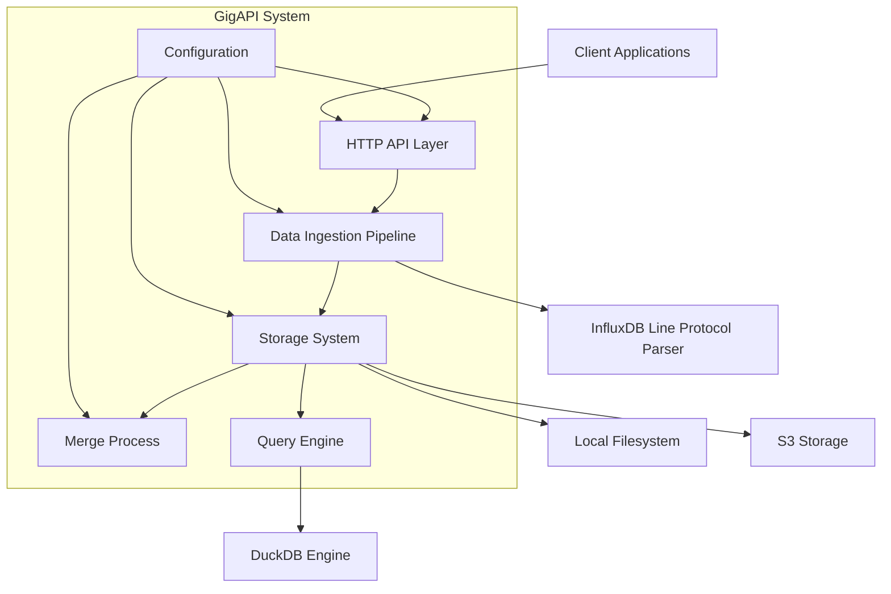
```mermaid
graph TD
    subgraph "GigAPI System"
        HTTP["HTTP API Layer"] --> DataIngestion["Data Ingestion Pipeline"]
        DataIngestion --> Storage["Storage System"]
        Storage --> MergeProcess["Merge Process"]
        Storage --> QueryEngine["Query Engine"]
        
        Configuration["Configuration"] --> HTTP
        Configuration --> DataIngestion
        Configuration --> Storage
        Configuration --> MergeProcess
    end
    
    Client["Client Applications"] --> HTTP
    
    Storage --> LocalFS["Local Filesystem"]
    Storage --> S3["S3 Storage"]
    
    QueryEngine --> DuckDB["DuckDB Engine"]
    
    DataIngestion --> LineProtoParser["InfluxDB Line Protocol Parser"]
```

This architecture follows a clean separation of concerns with several key components that work together to provide a complete time-series data management solution.


## Components Overview

GigAPI consists of the following primary components:

1. **HTTP API Layer**: Provides endpoints for writing and querying data
2. **Data Ingestion Pipeline**: Parses incoming data (primarily using InfluxDB line protocol)
3. **Storage System**: Manages data in an unordered in-memory store before flushing to disk as Parquet files
4. **Merge Process**: Compacts small files into larger ones using a tiered approach
5. **Query Engine**: Leverages DuckDB to execute SQL queries directly against Parquet files
6. **Configuration System**: Provides flexible configuration through environment variables or files

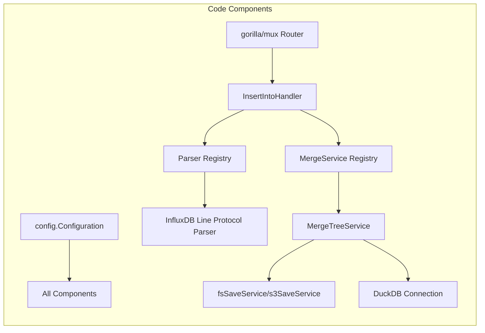
```mermaid
flowchart LR
    subgraph "Code Components"
        Router["gorilla/mux Router"] --> InsertHandler["InsertIntoHandler"]
        Config["config.Configuration"] --> All["All Components"]
        InsertHandler --> ParserRegistry["Parser Registry"]
        ParserRegistry --> LineProtoParser["InfluxDB Line Protocol Parser"]
        InsertHandler --> MergeServiceRegistry["MergeService Registry"]
        MergeServiceRegistry --> MergeTreeService["MergeTreeService"]
        MergeTreeService --> SaveService["fsSaveService/s3SaveService"]
        MergeTreeService --> DuckDB["DuckDB Connection"]
    end
```


## Data Flow

Data flows through GigAPI in the following sequence:

1. **Ingestion**: Client sends data to HTTP API endpoints using InfluxDB Line Protocol
2. **Parsing**: Data is parsed and structured according to the schema
3. **Buffering**: Parsed data is temporarily stored in memory
4. **Persistence**: Data is periodically flushed to Parquet files in a hierarchical structure
5. **Compaction**: Small files are progressively merged into larger files based on size thresholds
6. **Querying**: DuckDB executes SQL queries against the Parquet files on demand


## Storage Organization

GigAPI organizes data storage using a Hive partitioning scheme:

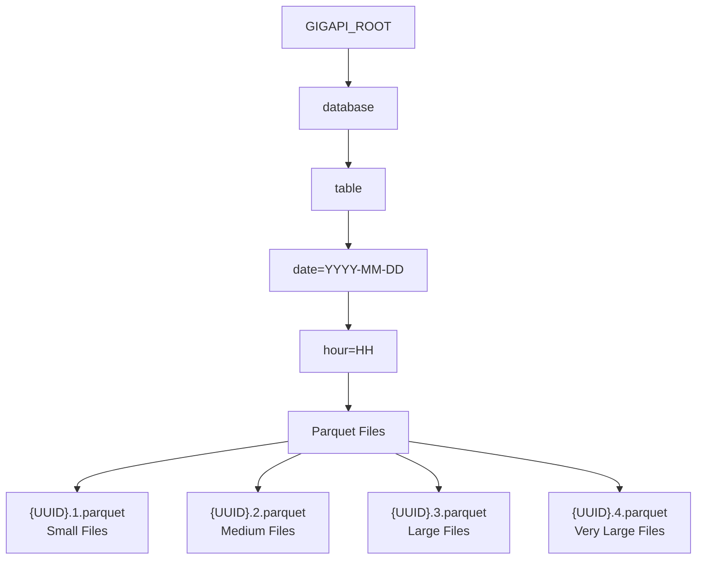
```mermaid
graph TD
    Root["GIGAPI_ROOT"] --> Database["database"]
    Database --> Table["table"]
    Table --> DatePartition["date=YYYY-MM-DD"]
    DatePartition --> HourPartition["hour=HH"]
    HourPartition --> Files["Parquet Files"]
    Files --> Level1["{UUID}.1.parquet<br>Small Files"]
    Files --> Level2["{UUID}.2.parquet<br>Medium Files"]
    Files --> Level3["{UUID}.3.parquet<br>Large Files"]
    Files --> Level4["{UUID}.4.parquet<br>Very Large Files"]
```

Files are progressively compacted based on a tiered approach, with different merge frequencies and size thresholds for each level.


## Configuration Options

GigAPI can be configured through environment variables or a configuration file:

| Environment Variable | Description | Default Value |
|----------------------|-------------|---------------|
| GIGAPI_ROOT | Root directory for databases and tables | Current directory |
| GIGAPI_MERGE_TIMEOUT_S | Merge timeout in seconds | 10 |
| GIGAPI_SAVE_TIMEOUT_S | Save timeout in seconds | 1.0 |
| GIGAPI_NO_MERGES | Disables merges when set to true | false |
| PORT | Port number for the server | 7971 |

The configuration system supports both environment variables and configuration files, with sensible defaults provided for all options.


## Technical Foundation

GigAPI is built in Go and leverages several key technologies:

1. **DuckDB**: Embedded analytical database for query processing
2. **Apache Arrow**: In-memory columnar data format
3. **Apache Parquet**: Columnar storage file format
4. **InfluxDB Line Protocol**: Data ingestion format
5. **S3 API**: Object storage interface

These foundations provide the performance, reliability, and scalability required for time-series analytics workloads.


## Deployment

GigAPI can be deployed as a container using Docker:

```bash
docker pull ghcr.io/gigapi/gigapi:latest
```


This document provides a comprehensive overview of the GigAPI system architecture, explaining its key components, data flow, storage mechanisms, and interactions between different parts of the system. For specific details about data flow, see [Data Flow](#2.1), and for detailed information about individual components, see [Components](#2.2).

GigAPI is designed as a time-series data lake system optimized for analytical workloads, combining the performance of DuckDB with cloud-native architecture principles for a lightweight, scalable solution.

## System Architecture Overview

The GigAPI architecture consists of several key components working together to provide a complete time-series data solution. Below is a high-level architectural diagram showing the main components and their relationships:

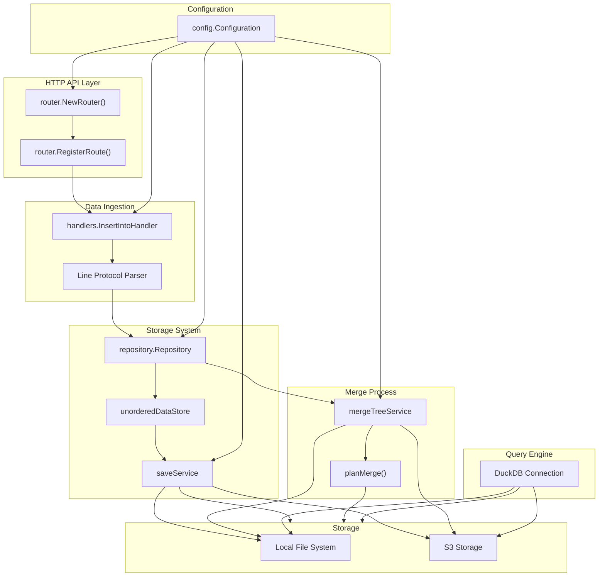
```mermaid
flowchart TD
    subgraph "HTTP API Layer"
        Router["router.NewRouter()"]
        Routes["router.RegisterRoute()"]
    end

    subgraph "Data Ingestion"
        Handlers["handlers.InsertIntoHandler"]
        Parsers["Line Protocol Parser"]
    end

    subgraph "Storage System"
        Repository["repository.Repository"]
        DataStore["unorderedDataStore"]
        SaveService["saveService"]
    end

    subgraph "Merge Process"
        MergeService["mergeTreeService"]
        MergePlanning["planMerge()"]
    end

    subgraph "Query Engine"
        DuckDB["DuckDB Connection"]
    end

    subgraph "Configuration"
        Config["config.Configuration"]
    end

    Router --> Routes
    Routes --> Handlers
    Handlers --> Parsers
    Parsers --> Repository
    Repository --> DataStore
    DataStore --> SaveService
    SaveService --> Storage
    Repository --> MergeService
    MergeService --> MergePlanning
    MergePlanning --> Storage
    DuckDB --> Storage

    Config --> Router
    Config --> Handlers
    Config --> Repository
    Config --> MergeService
    Config --> SaveService

    subgraph "Storage"
        LocalFS["Local File System"]
        S3["S3 Storage"]
    end
    
    SaveService --> LocalFS
    SaveService --> S3
    MergeService --> LocalFS
    MergeService --> S3
    DuckDB --> LocalFS
    DuckDB --> S3
```


## Initialization Flow

The initialization sequence in GigAPI establishes the foundation for the system's operation:

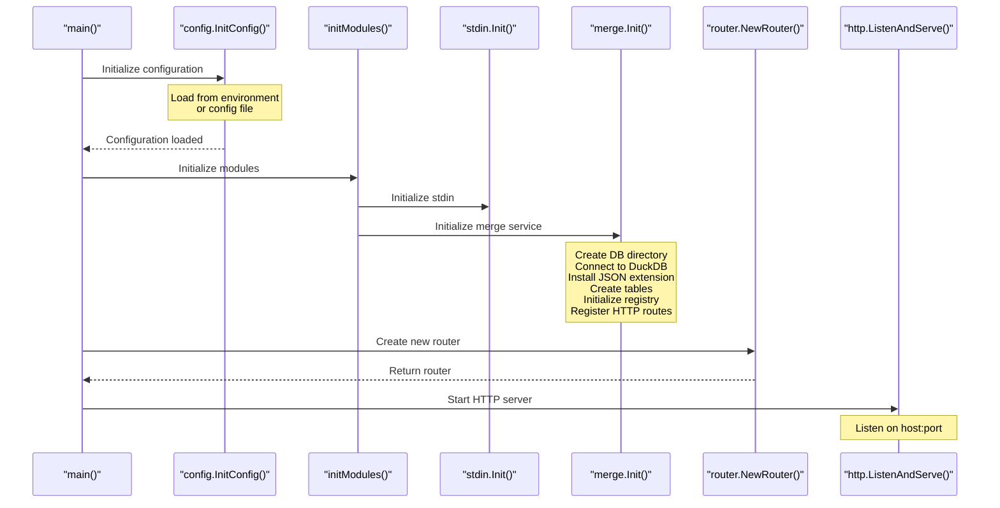
```mermaid
sequenceDiagram
    participant Main as "main()"
    participant Config as "config.InitConfig()"
    participant Modules as "initModules()"
    participant Stdin as "stdin.Init()"
    participant Merge as "merge.Init()"
    participant Router as "router.NewRouter()"
    participant HTTP as "http.ListenAndServe()"

    Main->>Config: Initialize configuration
    Note over Config: Load from environment<br>or config file
    Config-->>Main: Configuration loaded
    
    Main->>Modules: Initialize modules
    Modules->>Stdin: Initialize stdin
    Modules->>Merge: Initialize merge service
    Note over Merge: Create DB directory<br>Connect to DuckDB<br>Install JSON extension<br>Create tables<br>Initialize registry<br>Register HTTP routes
    
    Main->>Router: Create new router
    Router-->>Main: Return router
    
    Main->>HTTP: Start HTTP server
    Note over HTTP: Listen on host:port
```


## Key Components

### HTTP API Layer

The HTTP API layer serves as the interface for clients to interact with GigAPI, providing endpoints for data ingestion and querying.

- **Router**: Handles HTTP requests and routes them to appropriate handlers
- **Routes**: Defined paths for various API endpoints, including:
  - Write endpoints compatible with InfluxDB line protocol format
  - Health and ping endpoints
  - GigAPI-specific endpoints for table creation and data insertion


### Data Ingestion Pipeline

The data ingestion pipeline processes incoming data from various sources and formats, transforming it into a structured format for storage.

- **Handlers**: Process incoming HTTP requests
- **Parsers**: Parse data from different formats (primarily InfluxDB Line Protocol)
- **Repository**: Manages data after parsing and before storage


### Storage System

The storage system manages how data is persisted, organized, and accessed:

- **Repository**: Coordinates storage operations
- **Data Store**: In-memory buffer for data before it's written to disk
- **Save Service**: Handles flushing data from memory to disk as Parquet files
- **Storage Backends**: Supports multiple storage backends:
  - Local File System
  - S3-compatible object storage

The data is stored in a hierarchical structure following Hive partitioning principles:

```
{GIGAPI_ROOT}
  /{database}
    /{table}
      /date={YYYY-MM-DD}
        /hour={HH}
          /{UUID}.{LEVEL}.parquet
          metadata.json
```


### Merge Process

The merge process compacts small Parquet files into larger ones in a tiered approach similar to LSM (Log-Structured Merge) trees:

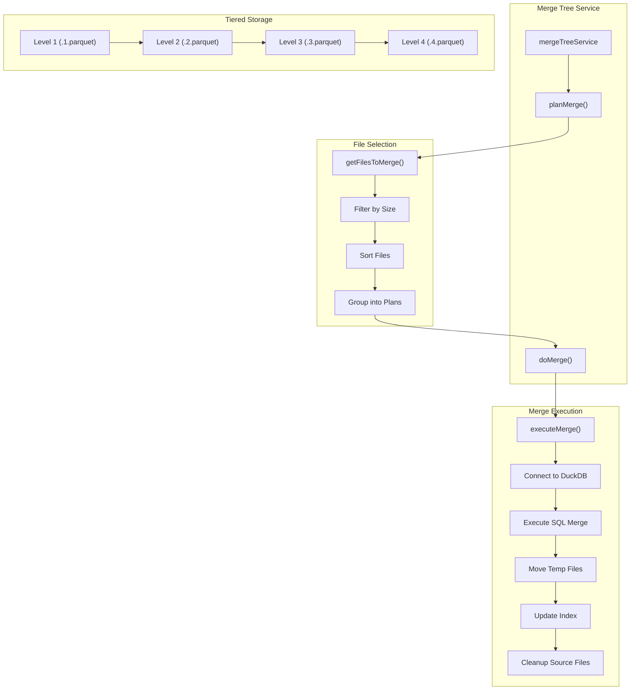
```mermaid
flowchart TD
    subgraph "Merge Tree Service"
        MergeService["mergeTreeService"]
        PlanMerge["planMerge()"]
        DoMerge["doMerge()"]
    end

    subgraph "File Selection"
        GetFiles["getFilesToMerge()"]
        FilterSize["Filter by Size"]
        SortFiles["Sort Files"]
        GroupPlans["Group into Plans"]
    end

    subgraph "Merge Execution"
        ExecuteMerge["executeMerge()"]
        ConnectDB["Connect to DuckDB"]
        ExecuteSQL["Execute SQL Merge"]
        MoveFiles["Move Temp Files"]
        UpdateIndex["Update Index"]
        CleanupSrc["Cleanup Source Files"]
    end

    subgraph "Tiered Storage"
        Tier1["Level 1 (.1.parquet)"]
        Tier2["Level 2 (.2.parquet)"]
        Tier3["Level 3 (.3.parquet)"]
        Tier4["Level 4 (.4.parquet)"]
    end

    MergeService --> PlanMerge
    PlanMerge --> GetFiles
    GetFiles --> FilterSize
    FilterSize --> SortFiles
    SortFiles --> GroupPlans
    GroupPlans --> DoMerge
    
    DoMerge --> ExecuteMerge
    ExecuteMerge --> ConnectDB
    ConnectDB --> ExecuteSQL
    ExecuteSQL --> MoveFiles
    MoveFiles --> UpdateIndex
    UpdateIndex --> CleanupSrc
    
    Tier1 --> Tier2
    Tier2 --> Tier3
    Tier3 --> Tier4
```

Merge levels follow a tiered strategy:

| Merge Level   | Source | Target | Frequency               | Max Size |
|---------------|--------|--------|-------------------------|----------|
| Level 1 -> 2  | `.1`   | `.2`   | `MERGE_TIMEOUT_S` = 10s | 100 MB   |
| Level 2 -> 3  | `.2`   | `.3`   | 10 × `MERGE_TIMEOUT_S`  | 400 MB   |
| Level 3 -> 4  | `.3`   | `.4`   | 100 × `MERGE_TIMEOUT_S` | 4 GB     |


### Query Engine

GigAPI integrates with DuckDB for query processing:

- Uses DuckDB to execute SQL queries against Parquet files
- Provides optimized analytical capabilities for time-series data
- Supports both direct querying and external query engines


### Configuration System

The configuration system provides flexibility in setting up and customizing GigAPI:

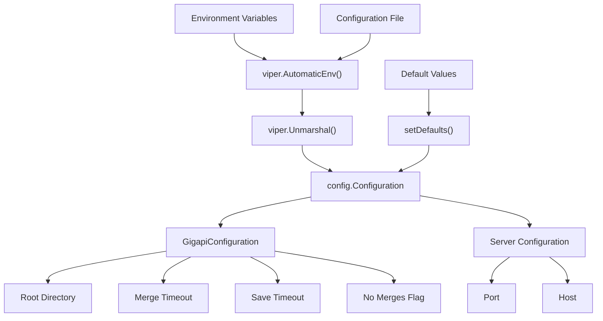
```mermaid
flowchart TD
    Config["config.Configuration"]
    EnvVars["Environment Variables"]
    ConfigFile["Configuration File"]
    Defaults["Default Values"]
    
    EnvVars --> Viper["viper.AutomaticEnv()"]
    ConfigFile --> Viper
    Viper --> Unmarshal["viper.Unmarshal()"]
    Unmarshal --> Config
    Defaults --> SetDefaults["setDefaults()"]
    SetDefaults --> Config
    
    Config --> GigapiConfig["GigapiConfiguration"]
    Config --> ServerConfig["Server Configuration"]
    
    GigapiConfig --> Root["Root Directory"]
    GigapiConfig --> MergeTimeout["Merge Timeout"]
    GigapiConfig --> SaveTimeout["Save Timeout"]
    GigapiConfig --> NoMerges["No Merges Flag"]
    
    ServerConfig --> Port["Port"]
    ServerConfig --> Host["Host"]
```

Key configuration options:

| Option               | Environment Variable    | Default | Description                                 |
|----------------------|-------------------------|---------|---------------------------------------------|
| Root Directory       | GIGAPI_ROOT             | `.`     | Root directory for databases and tables     |
| Merge Timeout        | GIGAPI_MERGE_TIMEOUT_S | 10      | Merge timeout in seconds                    |
| Save Timeout         | GIGAPI_SAVE_TIMEOUT_S  | 1.0     | Save timeout in seconds                     |
| No Merges            | GIGAPI_NO_MERGES       | false   | Disables merges when set to true            |
| Port                 | PORT                    | 7971    | Port number for the server                  |
| Host                 | HOST                    | 0.0.0.0 | Host address for the server                 |


## Data Flow

### Write Path

The write path in GigAPI follows this sequence:

1. HTTP request arrives at a write endpoint
2. Router forwards the request to the appropriate handler
3. Handler parses the data (typically from InfluxDB Line Protocol)
4. Parsed data is sent to the Repository
5. Repository stores data in the in-memory buffer (unorderedDataStore)
6. Data is periodically flushed to disk as Parquet files
7. Merge process compacts small files into larger ones

### Read Path

The read path works as follows:

1. Query request arrives through the HTTP API
2. Query is translated to SQL
3. DuckDB executes the query against the Parquet files
4. Results are returned to the client

## Storage and Partitioning

GigAPI uses a Hive partitioning scheme for data organization:

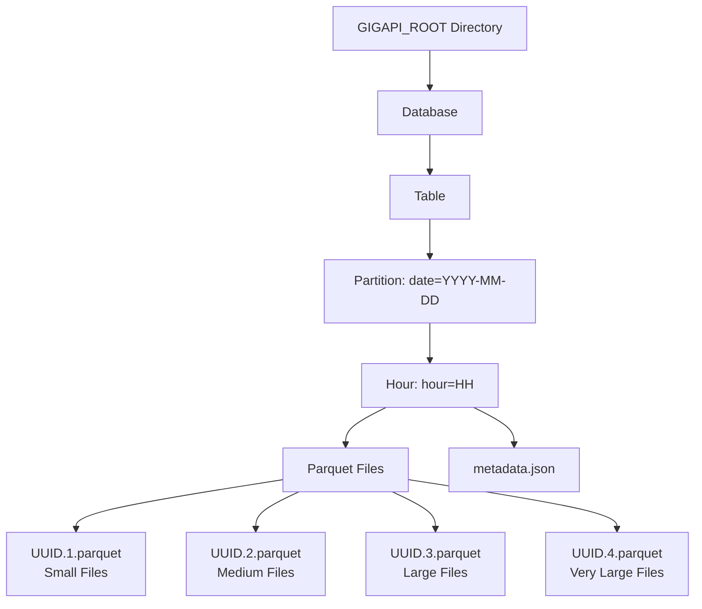
```mermaid
flowchart TD
    Root["GIGAPI_ROOT Directory"]
    Database["Database"]
    Table["Table"]
    Date["Partition: date=YYYY-MM-DD"]
    Hour["Hour: hour=HH"]
    Files["Parquet Files"]
    
    Root --> Database
    Database --> Table
    Table --> Date
    Date --> Hour
    Hour --> Files
    
    Files --> Level1["UUID.1.parquet<br>Small Files"]
    Files --> Level2["UUID.2.parquet<br>Medium Files"]
    Files --> Level3["UUID.3.parquet<br>Large Files"]
    Files --> Level4["UUID.4.parquet<br>Very Large Files"]
    Hour --> Metadata["metadata.json"]
```

This partitioning strategy provides several advantages:
- Efficient time-based queries
- Parallelization of data processing
- Simplified data retention policies
- Optimized file size for performance


## Summary

GigAPI's architecture combines several subsystems to create an efficient time-series data lake:

1. **Modular Design**: Clear separation of concerns between components
2. **Tiered Storage**: LSM-like approach for optimizing writes and reads
3. **Flexible Configuration**: Adaptable to various deployment scenarios
4. **Multiple Storage Backends**: Support for both local filesystem and S3 storage
5. **Integration with DuckDB**: Leveraging optimized analytical query capabilities
6. **Hive Partitioning**: Efficient organization of time-series data

This architecture enables GigAPI to provide high-performance, scalable time-series data storage and analytics while maintaining a lightweight, easy-to-operate design.


## Data Flow

GigAPI processes time-series data through a pipeline that transforms raw HTTP requests into optimized Parquet files. The system follows a write path that begins with receiving data (typically in InfluxDB Line Protocol format), parsing it into structured records, and then storing and organizing it for efficient querying.

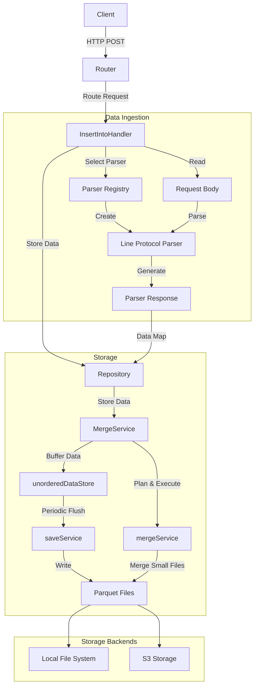
```mermaid
flowchart TD
    Client["Client"] -->|"HTTP POST"| Router["Router"]
    Router -->|"Route Request"| Handler["InsertIntoHandler"]
    
    subgraph "Data Ingestion"
        Handler -->|"Select Parser"| ParserRegistry["Parser Registry"]
        ParserRegistry -->|"Create"| Parser["Line Protocol Parser"]
        Handler -->|"Read"| RequestBody["Request Body"]
        RequestBody -->|"Parse"| Parser
        Parser -->|"Generate"| ParserResponse["Parser Response"]
    end
    
    subgraph "Storage"
        Handler -->|"Store Data"| Repository["Repository"]
        Repository -->|"Store Data"| MergeService["MergeService"]
        MergeService -->|"Buffer Data"| DataStore["unorderedDataStore"]
        
        DataStore -->|"Periodic Flush"| SaveService["saveService"]
        SaveService -->|"Write"| ParquetFile["Parquet Files"]
        
        MergeService -->|"Plan & Execute"| Merger["mergeService"]
        Merger -->|"Merge Small Files"| ParquetFile
    end
    
    ParserResponse -->|"Data Map"| Repository
    
    subgraph "Storage Backends"
        ParquetFile --> LocalFS["Local File System"]
        ParquetFile --> S3["S3 Storage"]
    end
```


## Data Ingestion

The data ingestion process begins when a client sends data to one of GigAPI's HTTP endpoints. The system primarily supports InfluxDB Line Protocol format, but is designed to be extensible for other formats.

### HTTP API Endpoints

GigAPI exposes several HTTP endpoints that accept data writes, as registered in the system initialization:

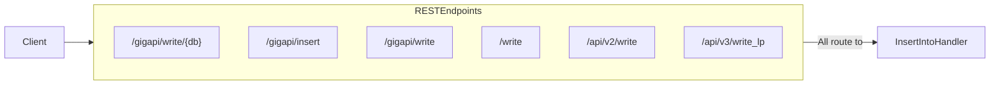
```mermaid
flowchart LR
    Client["Client"] --> RESTEndpoints

    subgraph "RESTEndpoints"
        direction TB
        Main["/gigapi/write/{db}"]
        GigapiInsert["/gigapi/insert"]
        GigapiWrite["/gigapi/write"]
        InfluxWrite["/write"]
        InfluxV2["/api/v2/write"]
        InfluxV3["/api/v3/write_lp"]
    end
    
    RESTEndpoints -->|"All route to"| InsertHandler["InsertIntoHandler"]
```


Each of these endpoints routes to the same `InsertIntoHandler` function, which processes incoming data regardless of the specific endpoint used. This design provides compatibility with various client libraries and systems.

### Request Processing

When a request arrives at the `InsertIntoHandler`, it follows these steps:

1. Determine the content type and select an appropriate parser
2. Extract the database name from URL parameters or path variables
3. Handle compression (if the request is gzip-encoded)
4. Pass the request body to the parser
5. Store the parsed data using the repository

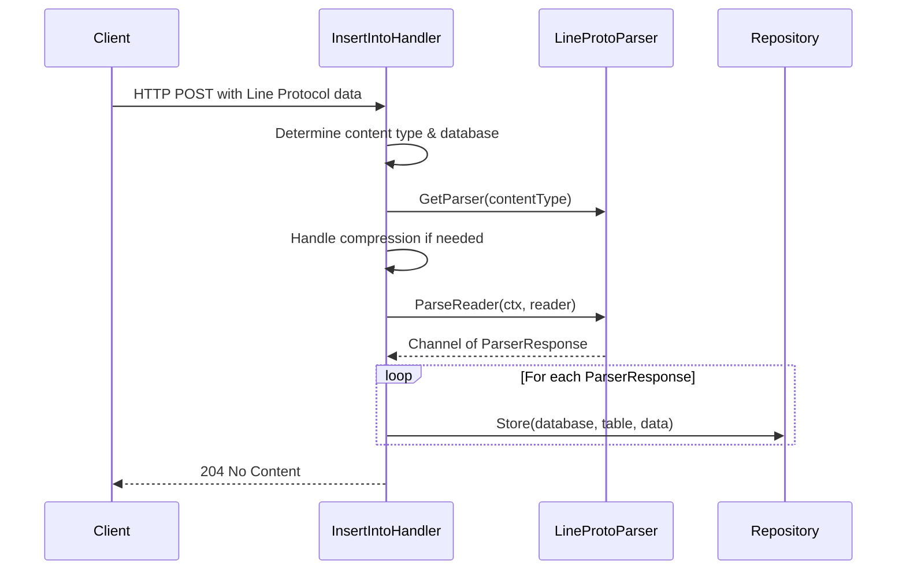
```mermaid
sequenceDiagram
    participant Client
    participant Handler as InsertIntoHandler
    participant Parser as LineProtoParser
    participant Repo as Repository

    Client->>Handler: HTTP POST with Line Protocol data
    Handler->>Handler: Determine content type & database
    Handler->>Parser: GetParser(contentType)
    Handler->>Handler: Handle compression if needed
    Handler->>Parser: ParseReader(ctx, reader)
    Parser-->>Handler: Channel of ParserResponse
    loop For each ParserResponse
        Handler->>Repo: Store(database, table, data)
    end
    Handler-->>Client: 204 No Content
```


### Parsing

The default parser for GigAPI is the `LineProtoParser`, which handles InfluxDB Line Protocol data. The parsing process:

1. Reads the input line by line
2. Parses each line using InfluxDB's models package
3. Extracts measurement name (table), tags, fields, and timestamp
4. Groups data by schema ID (based on fields and tags structure)
5. Returns a channel of `ParserResponse` objects containing the structured data

Each `ParserResponse` contains:
- Database name (if specified)
- Table name (measurement name)
- Data map (containing fields, tags, and timestamps)


## Data Storage

After data is parsed, it follows a storage path that eventually leads to persistent Parquet files on disk or in cloud storage.

### Storage Flow

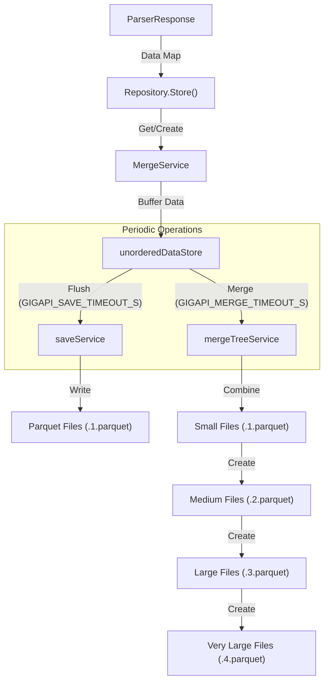
```mermaid
flowchart TD
    ParserResponse["ParserResponse"] -->|"Data Map"| Repository["Repository.Store()"]
    Repository -->|"Get/Create"| MergeService["MergeService"]
    MergeService -->|"Buffer Data"| UnorderedStore["unorderedDataStore"]
    
    subgraph "Periodic Operations"
        UnorderedStore -->|"Flush (GIGAPI_SAVE_TIMEOUT_S)"| SaveService["saveService"]
        UnorderedStore -->|"Merge (GIGAPI_MERGE_TIMEOUT_S)"| MergeTreeService["mergeTreeService"]
    end
    
    SaveService -->|"Write"| ParquetFiles["Parquet Files (.1.parquet)"]
    MergeTreeService -->|"Combine"| SmallFiles["Small Files (.1.parquet)"]
    SmallFiles -->|"Create"| MediumFiles["Medium Files (.2.parquet)"]
    MediumFiles -->|"Create"| LargeFiles["Large Files (.3.parquet)"]
    LargeFiles -->|"Create"| VeryLargeFiles["Very Large Files (.4.parquet)"]
```


### Directory Structure

Data is stored in a hierarchical directory structure that follows Hive partitioning conventions:

```
/GIGAPI_ROOT
  /database
    /table
      /date=YYYY-MM-DD
        /hour=HH
          *.parquet
          metadata.json
```

This partitioning scheme allows for efficient querying of data within specific time ranges.


### File Naming and Levels

Parquet files follow a specific naming convention that indicates their level in the merge hierarchy:

```
{UUID}.{LEVEL}.parquet
```

Where:
- `UUID` is a unique identifier for the file
- `LEVEL` is a number (1-4) indicating the file's position in the merge hierarchy

| Level | File Pattern | Max Size | Merge Frequency | Description |
|-------|-------------|----------|-----------------|-------------|
| 1     | `.1.parquet` | 100 MB   | MERGE_TIMEOUT_S | Small, recently written files |
| 2     | `.2.parquet` | 400 MB   | MERGE_TIMEOUT_S * 10 | Medium files from merged level 1 |
| 3     | `.3.parquet` | 4 GB     | MERGE_TIMEOUT_S * 10 * 10 | Large files from merged level 2 |
| 4     | `.4.parquet` | No limit | Rare | Very large files from merged level 3 |


## Merge Process

The merge process is a critical component of GigAPI's architecture, implementing an LSM (Log-Structured Merge) tree-like approach for managing data files.

### Merge Cycle

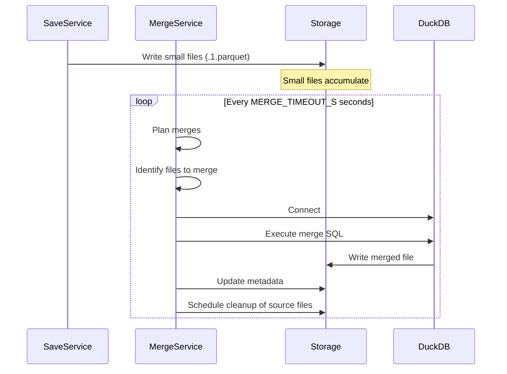
```mermaid
sequenceDiagram
    participant SaveService
    participant MergeService
    participant Storage
    participant DuckDB

    SaveService->>Storage: Write small files (.1.parquet)
    Note over Storage: Small files accumulate
    
    loop Every MERGE_TIMEOUT_S seconds
        MergeService->>MergeService: Plan merges
        MergeService->>MergeService: Identify files to merge
        MergeService->>DuckDB: Connect
        MergeService->>DuckDB: Execute merge SQL
        DuckDB->>Storage: Write merged file
        MergeService->>Storage: Update metadata
        MergeService->>Storage: Schedule cleanup of source files
    end
```


### Tiered Merging Strategy

GigAPI employs a tiered merging strategy where:

1. Level 1 files (`.1.parquet`) are the smallest and most frequently merged
2. Each subsequent level contains larger files merged less frequently
3. Higher levels provide better read performance due to fewer files
4. Lower levels provide better write performance due to smaller files

This approach balances write throughput with query performance, optimizing for both use cases.

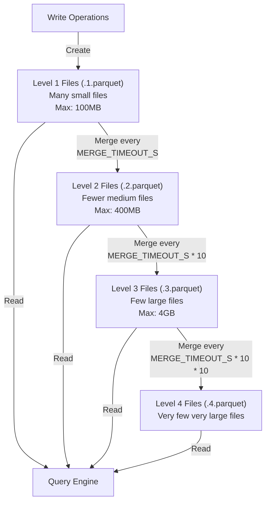
```mermaid
flowchart TD
    Write["Write Operations"] -->|"Create"| Level1["Level 1 Files (.1.parquet)<br>Many small files<br>Max: 100MB"]
    
    Level1 -->|"Merge every<br>MERGE_TIMEOUT_S"| Level2["Level 2 Files (.2.parquet)<br>Fewer medium files<br>Max: 400MB"]
    
    Level2 -->|"Merge every<br>MERGE_TIMEOUT_S * 10"| Level3["Level 3 Files (.3.parquet)<br>Few large files<br>Max: 4GB"]
    
    Level3 -->|"Merge every<br>MERGE_TIMEOUT_S * 10 * 10"| Level4["Level 4 Files (.4.parquet)<br>Very few very large files"]
    
    Level1 -->|"Read"| QueryEngine["Query Engine"]
    Level2 -->|"Read"| QueryEngine
    Level3 -->|"Read"| QueryEngine
    Level4 -->|"Read"| QueryEngine
```


## Comprehensive Data Flow

The following diagram presents a comprehensive view of data flow through the GigAPI system, showing the complete path from client request to storage and query:

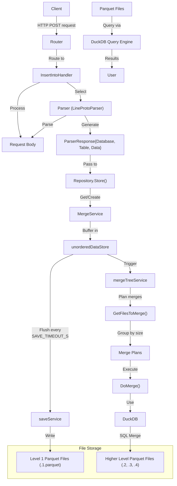
```mermaid
flowchart TD
    Client["Client"] -->|"HTTP POST request"| Router["Router"]
    Router -->|"Route to"| Handler["InsertIntoHandler"]
    
    Handler -->|"Select"| Parser["Parser (LineProtoParser)"]
    Handler -->|"Process"| Body["Request Body"]
    Parser -->|"Parse"| Body
    
    Parser -->|"Generate"| Response["ParserResponse{Database, Table, Data}"]
    Response -->|"Pass to"| Repository["Repository.Store()"]
    
    Repository -->|"Get/Create"| MergeService["MergeService"]
    MergeService -->|"Buffer in"| DataStore["unorderedDataStore"]
    
    DataStore -->|"Flush every<br>SAVE_TIMEOUT_S"| SaveService["saveService"]
    SaveService -->|"Write"| Level1["Level 1 Parquet Files (.1.parquet)"]
    
    DataStore -->|"Trigger"| MergeTreeService["mergeTreeService"]
    MergeTreeService -->|"Plan merges"| GetFilesToMerge["GetFilesToMerge()"]
    GetFilesToMerge -->|"Group by size"| MergePlans["Merge Plans"]
    
    MergePlans -->|"Execute"| DoMerge["DoMerge()"]
    DoMerge -->|"Use"| DuckDB["DuckDB"]
    DuckDB -->|"SQL Merge"| HigherLevelFiles["Higher Level Parquet Files (.2, .3, .4)"]
    
    subgraph "File Storage"
        Level1
        HigherLevelFiles
    end
    
    File["Parquet Files"] -->|"Query via"| QueryEngine["DuckDB Query Engine"]
    QueryEngine -->|"Results"| User["User"]
```


## Configuration Impact on Data Flow

The data flow in GigAPI is influenced by several configuration parameters:

| Configuration Parameter | Default | Impact on Data Flow |
|------------------------|---------|---------------------|
| GIGAPI_ROOT            | Current directory | Root location for all stored data |
| GIGAPI_MERGE_TIMEOUT_S | 10 seconds | Frequency of level 1 file merges |
| GIGAPI_SAVE_TIMEOUT_S  | 1 second | Frequency of memory buffer flushes to disk |
| GIGAPI_NO_MERGES       | false | When true, disables the merge process entirely |


These parameters allow tuning of the data flow to optimize for different workloads. For instance:
- Increasing `SAVE_TIMEOUT_S` reduces disk I/O but increases potential data loss in case of crashes
- Increasing `MERGE_TIMEOUT_S` reduces CPU usage from merges but may result in more small files
- Setting `NO_MERGES` to true prevents compaction, which can be useful for testing or specific workloads1b:T2b5e,# Components

## Core Components Overview

GigAPI's architecture consists of several discrete but interconnected components, each responsible for specific aspects of the system's functionality.

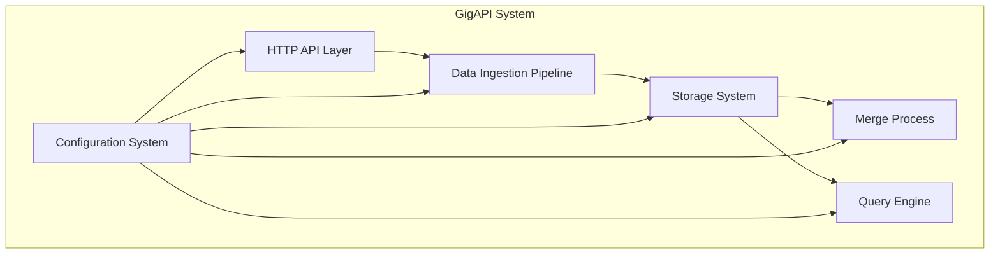
```mermaid
graph TD
    subgraph "GigAPI System"
        API["HTTP API Layer"]
        Ingestion["Data Ingestion Pipeline"]
        Storage["Storage System"]
        Merge["Merge Process"]
        Query["Query Engine"]
        Config["Configuration System"]
        
        API --> Ingestion
        Ingestion --> Storage
        Storage --> Merge
        Storage --> Query
        
        Config --> API
        Config --> Ingestion
        Config --> Storage
        Config --> Merge
        Config --> Query
    end
```


### HTTP API Layer

The HTTP API Layer serves as the entry point for all external interactions with GigAPI. It provides endpoints for both writing data and executing queries.

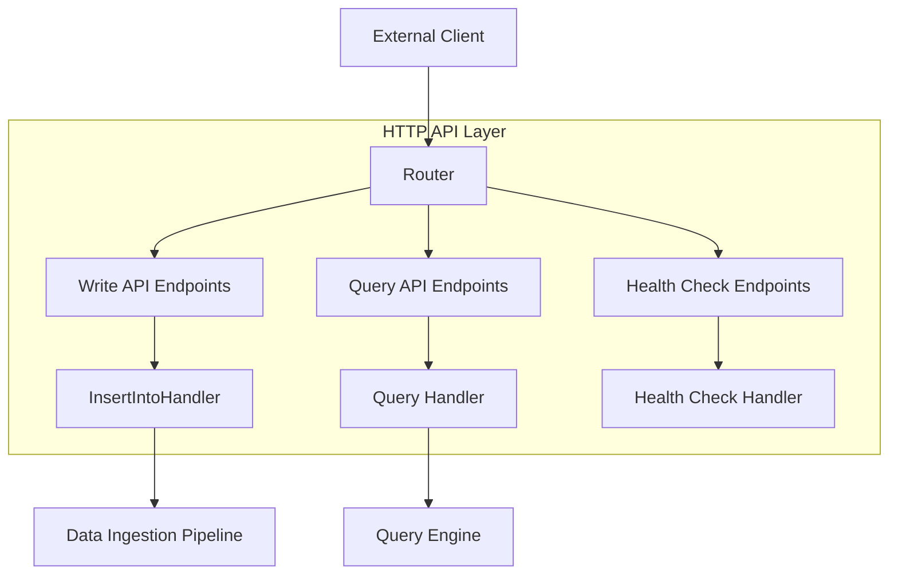
```mermaid
flowchart TD
    Client["External Client"] --> Routes["Router"]
    
    subgraph "HTTP API Layer"
        Routes --> WriteAPI["Write API Endpoints"]
        Routes --> QueryAPI["Query API Endpoints"]
        Routes --> HealthAPI["Health Check Endpoints"]
        
        WriteAPI --> Handler["InsertIntoHandler"]
        QueryAPI --> QueryHandler["Query Handler"]
        HealthAPI --> HealthCheck["Health Check Handler"]
    end
    
    Handler --> Ingestion["Data Ingestion Pipeline"]
    QueryHandler --> QueryEngine["Query Engine"]
```

The router handles multiple endpoint styles for compatibility with various client applications, including:

- Native GigAPI endpoints (`/gigapi/write`, `/gigapi/insert`)
- InfluxDB-compatible endpoints (`/write`, `/api/v2/write`, `/api/v3/write_lp`)
- Health check endpoints (`/health`, `/ping`)


### Data Ingestion Pipeline

The Data Ingestion Pipeline is responsible for parsing incoming data formats (primarily InfluxDB Line Protocol) and transforming them into a structured format that can be stored in the system.

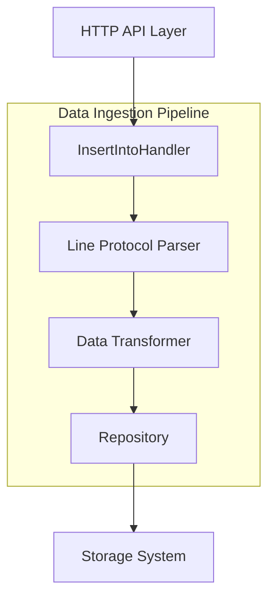
```mermaid
flowchart TD
    API["HTTP API Layer"] --> Handler["InsertIntoHandler"]
    
    subgraph "Data Ingestion Pipeline"
        Handler --> Parser["Line Protocol Parser"]
        Parser --> DataTransformer["Data Transformer"]
        DataTransformer --> Repository["Repository"]
    end
    
    Repository --> Storage["Storage System"]
```

The ingestion pipeline includes:

1. Request handlers that receive and validate incoming data
2. Parsers that convert external data formats to internal representations
3. A repository system that interfaces with the storage layer


### Storage System

The Storage System manages how data is stored, organized, and retrieved. It implements a hierarchical structure based on Hive partitioning and uses Parquet as the primary file format.

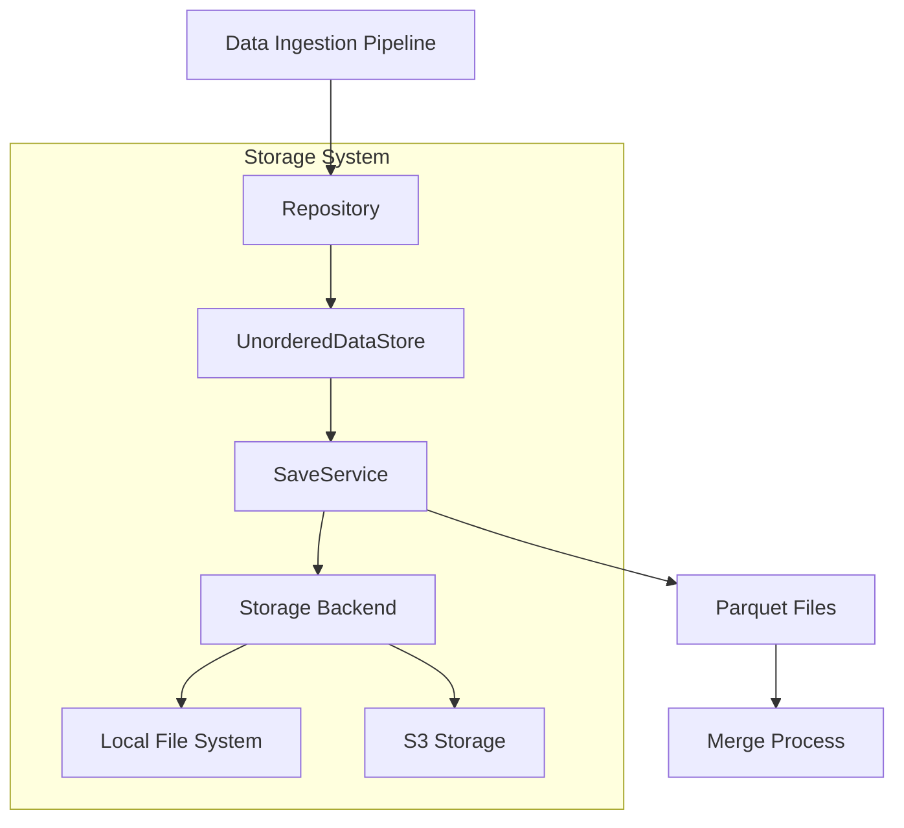
```mermaid
flowchart TD
    Ingestion["Data Ingestion Pipeline"] --> Repository["Repository"]
    
    subgraph "Storage System"
        Repository --> UnorderedStore["UnorderedDataStore"]
        UnorderedStore --> SaveService["SaveService"]
        SaveService --> FileSystem["Storage Backend"]
        
        FileSystem --> LocalFS["Local File System"]
        FileSystem --> S3["S3 Storage"]
    end
    
    SaveService --> ParquetFiles["Parquet Files"]
    ParquetFiles --> MergeProcess["Merge Process"]
```

The storage system:
- Temporarily holds data in memory in an unordered store
- Periodically flushes data to disk as Parquet files
- Organizes files in a hierarchical structure (database/table/date/hour)
- Supports multiple backend storage options (local filesystem and S3)


### Merge Process

The Merge Process implements an LSM (Log-Structured Merge) tree-like approach for managing data files. It periodically merges smaller files into larger ones to optimize storage and query performance.

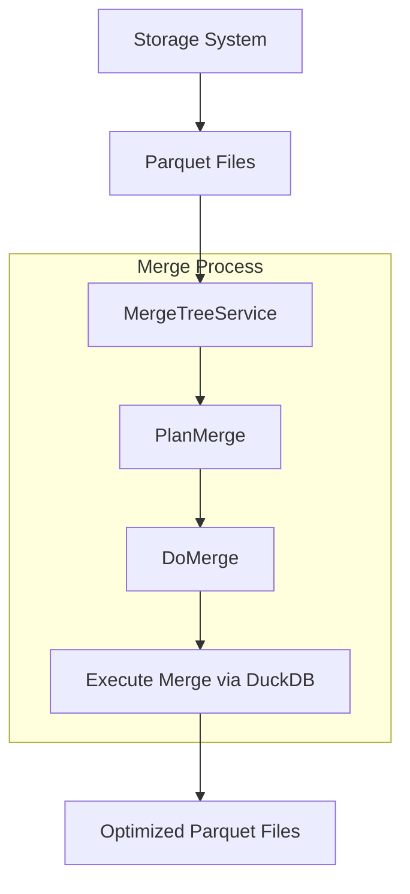
```mermaid
flowchart TD
    Storage["Storage System"] --> Files["Parquet Files"]
    
    subgraph "Merge Process"
        MergeService["MergeTreeService"]
        PlanMerge["PlanMerge"]
        DoMerge["DoMerge"]
        
        MergeService --> PlanMerge
        PlanMerge --> DoMerge
        DoMerge --> ExecuteMerge["Execute Merge via DuckDB"]
    end
    
    Files --> MergeService
    ExecuteMerge --> OptimizedFiles["Optimized Parquet Files"]
```

The merge process employs a tiered strategy:

| Merge Level | Source | Target | Frequency | Max Size |
|-------------|--------|--------|-----------|----------|
| Level 1 → 2 | `.1` | `.2` | `MERGE_TIMEOUT_S` = 10s | 100 MB |
| Level 2 → 3 | `.2` | `.3` | `MERGE_TIMEOUT_S` * 10 | 400 MB |
| Level 3 → 4 | `.3` | `.4` | `MERGE_TIMEOUT_S` * 10 * 10 | 4 GB |


### Query Engine

The Query Engine leverages DuckDB to execute SQL queries directly against Parquet files, providing analytical capabilities with high performance.

```mermaid
flowchart TD
    Client["Client"] --> QueryAPI["Query API"]
    
    subgraph "Query Engine"
        QueryAPI --> DuckDB["DuckDB Engine"]
        DuckDB --> ParquetReader["Parquet Reader"]
        ParquetReader --> FileSystem["Storage Backend"]
    end
    
    FileSystem --> LocalFS["Local File System"]
    FileSystem --> S3["S3 Storage"]
```

The query engine:
- Processes SQL queries from clients
- Translates queries to DuckDB operations
- Reads data directly from Parquet files
- Returns processed results to clients


### Configuration System

The Configuration System provides flexible configuration through environment variables or configuration files, with sensible defaults for all settings.

```mermaid
flowchart TD
    subgraph "Configuration Sources"
        EnvVars["Environment Variables"]
        ConfigFile["Configuration File"]
    end
    
    EnvVars --> ConfigLoader["Configuration Loader"]
    ConfigFile --> ConfigLoader
    
    subgraph "Configuration System"
        ConfigLoader --> ConfigStruct["Configuration Structure"]
        ConfigStruct --> GigapiConfig["GigapiConfiguration"]
        ConfigStruct --> ServerConfig["Server Configuration"]
    end
    
    GigapiConfig --> Components["System Components"]
    ServerConfig --> HTTPServer["HTTP Server"]
```

Key configuration parameters include:

| Parameter | Description | Default |
|-----------|-------------|---------|
| GIGAPI_ROOT | Root directory for databases and tables | Current directory |
| GIGAPI_MERGE_TIMEOUT_S | Merge timeout in seconds | 10 |
| GIGAPI_SAVE_TIMEOUT_S | Save timeout in seconds | 1.0 |
| GIGAPI_NO_MERGES | Disables merges when true | false |
| PORT | Server port | 7971 |


## Component Interactions

The components of GigAPI interact in a pipeline-like fashion to process data from ingestion to storage and querying.

```mermaid
sequenceDiagram
    participant Client as "Client"
    participant API as "HTTP API Layer"
    participant Ingestion as "Data Ingestion"
    participant Storage as "Storage System"
    participant Merge as "Merge Process"
    participant Query as "Query Engine"
    
    Client->>API: Write Request
    API->>Ingestion: Parse Data
    Ingestion->>Storage: Store Data
    Storage->>Merge: Schedule Merge
    
    Client->>API: Query Request
    API->>Query: Execute Query
    Query->>Storage: Read Data
    Storage-->>Query: Return Data
    Query-->>API: Results
    API-->>Client: Response
```


## Implementation Highlights

### HTTP Server Initialization

The HTTP server is initialized during system startup, with routes registered for various endpoints:

```mermaid
flowchart TD
    Main["main()"] --> InitConfig["InitConfig()"]
    InitConfig --> Init["merge.Init()"]
    Init --> InitHandlers["InitHandlers()"]
    InitHandlers --> RegisterRoutes["RegisterRoutes()"]
    RegisterRoutes --> NewRouter["NewRouter()"]
    NewRouter --> ListenAndServe["ListenAndServe()"]
```


### DuckDB Integration

GigAPI integrates with DuckDB to provide SQL query capabilities:

```mermaid
flowchart TD
    Init["merge.Init()"] --> ConnectDuckDB["ConnectDuckDB()"]
    ConnectDuckDB --> InstallExtensions["Install and Load JSON Extension"]
    InstallExtensions --> CreateTables["Create DuckDB Tables"]
    CreateTables --> InitRegistry["Initialize Registry"]
```

This integration enables:
- Direct SQL queries against Parquet files
- Efficient data compaction through SQL-based merges
- Analytical query capabilities with DuckDB's optimized execution engine


### Storage Hierarchy

The storage system organizes data in a hierarchical structure:

```mermaid
graph TD
    Root["GIGAPI_ROOT"] --> Database["Database"]
    Database --> Table["Table"]
    Table --> DatePartition["Partition: date=YYYY-MM-DD"]
    DatePartition --> HourPartition["Hour: hour=HH"]
    HourPartition --> ParquetFiles["Parquet Files"]
    ParquetFiles --> Level1["UUID.1.parquet (Small)"]
    ParquetFiles --> Level2["UUID.2.parquet (Medium)"]
    ParquetFiles --> Level3["UUID.3.parquet (Large)"]
    ParquetFiles --> Level4["UUID.4.parquet (Very Large)"]
```

This Hive partitioning scheme allows for efficient organization and querying of time-series data.


## Summary

GigAPI's component architecture promotes separation of concerns while enabling efficient data flow from ingestion to storage and querying. Each component has a clearly defined responsibility within the system:

1. **HTTP API Layer**: Provides the external interface for writing data and executing queries
2. **Data Ingestion Pipeline**: Parses and transforms incoming data
3. **Storage System**: Manages the organization and storage of data as Parquet files
4. **Merge Process**: Optimizes storage by compacting smaller files into larger ones
5. **Query Engine**: Enables analytical capabilities through DuckDB integration
6. **Configuration System**: Provides flexible configuration options

This modular architecture allows GigAPI to achieve its goal of being a fast, flexible, and simple timeseries data lake while minimizing operational overhead.


## Configuration Overview

GigAPI uses a flexible configuration system that supports both environment variables and configuration files. The configuration system allows you to customize aspects of the server, storage, and merge process to optimize for your particular workload and environment.

```mermaid
flowchart TD
    subgraph "Configuration Sources"
        EnvVars["Environment Variables"]
        ConfigFile["Configuration File"]
    end
    
    subgraph "Configuration Loading"
        InitConfig["InitConfig()"]
        Viper["Viper Library"]
        SetDefaults["setDefaults()"]
    end
    
    subgraph "Configuration Structure"
        Config["Configuration struct"]
        GigapiConfig["GigapiConfiguration struct"]
    end
    
    EnvVars --> Viper
    ConfigFile --> Viper
    Viper --> InitConfig
    InitConfig --> Config
    Config --> GigapiConfig
    SetDefaults --> Config
```


## Configuration Methods

GigAPI supports two primary methods of configuration:

### 1. Environment Variables

Environment variables are the recommended and most straightforward way to configure GigAPI, especially in containerized environments. GigAPI looks for environment variables prefixed with `GIGAPI_` (for GigAPI-specific settings) or directly for variables like `PORT` and `HOST`.

Example using Docker Compose:

```yaml
services:
  gigapi:
    image: ghcr.io/gigapi/gigapi:latest
    environment:
      - GIGAPI_ENABLED=true
      - GIGAPI_MERGE_TIMEOUT_S=10
      - GIGAPI_ROOT=/data
      - PORT=7971
```

### 2. Configuration Files

For more complex configurations, GigAPI can load settings from a configuration file. The file path can be provided when initializing the application.

```mermaid
sequenceDiagram
    participant App as "Main Application"
    participant ConfigInit as "config.InitConfig()"
    participant Viper as "Viper Library"
    participant ConfigStruct as "Configuration Struct"
    
    App->>ConfigInit: Call with optional file path
    alt Configuration file provided
        ConfigInit->>Viper: SetConfigFile(file)
        ConfigInit->>Viper: ReadInConfig()
    else Environment variables only
        ConfigInit->>Viper: AutomaticEnv()
    end
    Viper->>ConfigStruct: Unmarshal configuration
    ConfigInit->>ConfigStruct: Set default values for unspecified fields
    ConfigInit-->>App: Return populated Config object
```


## Configuration Structure

GigAPI's configuration is organized into a hierarchical structure:

```mermaid
classDiagram
    class Configuration {
        +GigapiConfiguration Gigapi
        +int Port
        +string Host
    }
    
    class GigapiConfiguration {
        +bool Enabled
        +string Root
        +int MergeTimeoutS
        +string Secret
        +bool AllowSaveToHD
        +float64 SaveTimeoutS
        +bool NoMerges
    }
    
    Configuration *-- GigapiConfiguration
```


## Configuration Options

### Server Configuration

| Option | Environment Variable | Default | Description |
|--------|---------------------|---------|-------------|
| Port | `PORT` | 7971 | Port number for the server to listen on |
| Host | `HOST` | "0.0.0.0" | Host address for the server to bind to |

### GigAPI Configuration

| Option | Environment Variable | Default | Description |
|--------|---------------------|---------|-------------|
| Enabled | `GIGAPI_ENABLED` | true | Enables or disables GigAPI functionality |
| Root | `GIGAPI_ROOT` | Current directory | Root directory for the databases and tables |
| MergeTimeoutS | `GIGAPI_MERGE_TIMEOUT_S` | 10 | Merge timeout in seconds for level 1 merges |
| Secret | `GIGAPI_SECRET` | "" | Secret key for secure operations (if required) |
| AllowSaveToHD | `GIGAPI_ALLOW_SAVE_TO_HD` | true | Controls whether data can be saved to disk |
| SaveTimeoutS | `GIGAPI_SAVE_TIMEOUT_S` | 1.0 | Interval in seconds for flushing data to disk |
| NoMerges | `GIGAPI_NO_MERGES` | false | When true, disables the merge process completely |


## Configuration Impact

The configuration settings directly affect various aspects of GigAPI's operation:

### Storage Configuration

The `GIGAPI_ROOT` setting determines where GigAPI stores all databases, tables, and their associated files. This directory follows a specific hierarchy:

```
/GIGAPI_ROOT
  /database_name
    /table_name
      /date=YYYY-MM-DD
        /hour=HH
          *.parquet
          metadata.json
```

The `GIGAPI_ALLOW_SAVE_TO_HD` setting controls whether data is persisted to disk or kept only in memory (useful for testing).


### Merge Process Configuration

The merge process is controlled by several configuration parameters:

- `GIGAPI_MERGE_TIMEOUT_S`: Defines the base interval for level 1 merges
- `GIGAPI_NO_MERGES`: Can disable the merge process entirely

The merge levels follow a progression based on the base merge timeout:

| Merge Level | Source | Target | Frequency | Max Size |
|-------------|--------|--------|-----------|----------|
| Level 1 → 2 | `.1` | `.2` | `MERGE_TIMEOUT_S` = 10 | 100 MB |
| Level 2 → 3 | `.2` | `.3` | `MERGE_TIMEOUT_S` * 10 | 400 MB |
| Level 3 → 4 | `.3` | `.4` | `MERGE_TIMEOUT_S` * 10 * 10 | 4 GB |


## Implementation Details

GigAPI's configuration system is implemented in the `config` package using the Viper library. The configuration flow works as follows:

1. `InitConfig()` is called during application startup
2. Viper is configured to load from environment variables with appropriate prefixes
3. If a configuration file is provided, it's loaded
4. Default values are applied for any unspecified settings
5. The configuration is made available through the global `Config` variable

```mermaid
flowchart TD
    Start["Application Start"] --> InitConfig["config.InitConfig()"]
    InitConfig --> Viper["Configure Viper"]
    Viper --> CheckFile{"Config file\nprovided?"}
    
    CheckFile -- Yes --> ReadFile["Read config file"]
    CheckFile -- No --> EnvVars["Use environment variables"]
    
    ReadFile --> Unmarshal["Unmarshal into Config struct"]
    EnvVars --> Unmarshal
    
    Unmarshal --> SetDefaults["Apply default values\nfor unspecified fields"]
    SetDefaults --> Final["Final Config ready"]
    
    Final --> ServerInit["Initialize server with Config"]
    Final --> MergeInit["Initialize merge process with Config"]
    Final --> StorageInit["Initialize storage with Config"]
```


## Best Practices

1. **Containerized Deployments**: Use environment variables for configuration in Docker and Kubernetes deployments
2. **Development Environment**: Consider using a configuration file during development for easier debugging
3. **Merge Process Tuning**: Adjust the `GIGAPI_MERGE_TIMEOUT_S` based on your write volume and read patterns
4. **Storage Location**: Always specify `GIGAPI_ROOT` to a persistent volume when deploying in containers

## Relationship to Other Components

The configuration system interacts with several other components in GigAPI:

```mermaid
graph TD
    Config["Configuration System"] --> API["HTTP API Layer"]
    Config --> Storage["Storage System"]
    Config --> MergeProcess["Merge Process"]
    
    subgraph "Configuration Impact"
        API -- "PORT, HOST" --> ServerSettings["Server Settings"]
        Storage -- "GIGAPI_ROOT" --> StorageLocation["Storage Location"]
        MergeProcess -- "GIGAPI_MERGE_TIMEOUT_S\nGIGAPI_NO_MERGES" --> MergeSettings["Merge Settings"]
    end
```


## API Overview

GigAPI exposes an HTTP API for data ingestion and health monitoring, built on top of the Go `gorilla/mux` router. The API is designed primarily for writing time-series data in various formats, with a focus on compatibility with common protocols like InfluxDB Line Protocol.

```mermaid
flowchart TB
    subgraph "HTTP API Layer"
        direction TB
        api["HTTP API Server<br>(Port 7971)"]
        
        subgraph "Write Endpoints"
            write_endpoints["Write Endpoints"]
            influx_endpoints["InfluxDB Compatibility"]
        end
        
        subgraph "Admin Endpoints"
            create["Table Creation"]
        end
        
        subgraph "Health Endpoints"
            health["Health Check"]
            ping["Ping"]
        end
    end
    
    Client["Client Applications"] --> api
    api --> write_endpoints
    api --> influx_endpoints
    api --> create
    api --> health
    api --> ping
    
    write_endpoints --> DataIngestion["Data Ingestion Pipeline"]
    influx_endpoints --> DataIngestion
    create --> Storage["Storage System"]
    
    DataIngestion --> Storage
```


## API Endpoints

The following table shows all available HTTP API endpoints:

| Endpoint | Method | Description | Handler |
|----------|--------|-------------|---------|
| `/gigapi/create` | POST | Create a new table | `CreateTableHandler` |
| `/gigapi/insert` | POST | Insert data into a table | `InsertIntoHandler` |
| `/gigapi/write/{db}` | POST | Write data to a specific database | `InsertIntoHandler` |
| `/gigapi/write` | POST | Write data (database specified in query parameters) | `InsertIntoHandler` |
| `/write` | POST | InfluxDB 2.x compatible write endpoint | `InsertIntoHandler` |
| `/api/v2/write` | POST | InfluxDB 2.x compatible write endpoint | `InsertIntoHandler` |
| `/api/v3/write_lp` | POST | InfluxDB 3.x compatible write endpoint | `InsertIntoHandler` |
| `/health` | GET | Health check endpoint | Anonymous function |
| `/ping` | GET | Simple ping endpoint | Anonymous function |


## Request Processing Flow

```mermaid
sequenceDiagram
    participant Client
    participant Router as "Router (mux)"
    participant Handler as "Handler Function"
    participant ErrorHandler as "Error Handler"
    participant DataPipeline as "Data Ingestion Pipeline"
    
    Client->>Router: HTTP Request
    Router->>ErrorHandler: Wrap handler with error handling
    ErrorHandler->>Handler: Execute handler logic
    
    alt Success Path
        Handler->>DataPipeline: Process data
        DataPipeline-->>Handler: Success response
        Handler-->>ErrorHandler: Return nil error
        ErrorHandler-->>Client: 200 OK + Response
    else Error Path
        Handler-->>ErrorHandler: Return error
        ErrorHandler-->>Client: 500 Internal Server Error + Error message
    end
```


## Write API

The Write API accepts data in InfluxDB Line Protocol format. This is the primary method for ingesting time-series data into GigAPI.

### Request Format

```
POST /write?db=<database>[&precision=<precision>]
```

Query Parameters:
- `db` (required): Target database name
- `precision` (optional): Timestamp precision (default: ns)

Request Body:
- InfluxDB Line Protocol formatted data

### Example

```
POST /write?db=mydb

weather,location=us-midwest,season=summer temperature=82
weather,location=us-east,season=summer temperature=80
weather,location=us-west,season=summer temperature=99
```

Upon receiving write requests, the data is parsed, stored in an in-memory buffer, and eventually flushed to Parquet files on disk according to the configured save timeout (default: 1 second).


## Data Processing Flow

```mermaid
flowchart TD
    client["Client"] -->|"POST /write?db=mydb"| router["Router"]
    router -->|"Route Request"| handler["InsertIntoHandler"]
    
    subgraph "Request Processing"
        handler -->|"Parse Request"| parseLineProtocol["Parse Line Protocol"]
        parseLineProtocol -->|"Convert to Data Map"| repository["Repository"]
        repository -->|"Store Data"| mergeService["MergeService"]
        mergeService -->|"Buffer Data"| dataStore["UnorderedDataStore"]
    end
    
    subgraph "Persistence"
        dataStore -->|"Periodic Flush<br>(SaveTimeoutS)"| saveService["SaveService"]
        saveService -->|"Write Parquet"| files["Parquet Files"]
    end
    
    subgraph "Storage Path"
        files -->|"Database/Table/Date/Hour"| storageSystem["Storage System"]
    end
```


## Health API

GigAPI provides health endpoints to monitor the service status:

### Health Check

```
GET /health
```

Response (200 OK):
```json
{
  "checks": [],
  "commit": "null-commit",
  "message": "Service is healthy",
  "name": "GigAPI",
  "status": "pass",
  "version": "0.0.0"
}
```

### Ping

```
GET /ping
```

Response: 204 No Content


## Configuration

The HTTP API server can be configured through environment variables or a configuration file:

| Environment Variable | Description | Default Value |
|----------------------|-------------|---------------|
| `PORT` | Port number for the server to listen on | 7971 |
| `HOST` | Host address to bind to | 0.0.0.0 |
| `GIGAPI_ROOT` | Root directory for databases and tables | Current directory |
| `GIGAPI_SAVE_TIMEOUT_S` | Timeout in seconds for flushing data to disk | 1.0 |
| `GIGAPI_MERGE_TIMEOUT_S` | Timeout in seconds for merging files | 10 |
| `GIGAPI_NO_MERGES` | Disable merges when set to true | false |

For more detailed configuration information, see [Configuration](#3).


## Server Initialization

```mermaid
sequenceDiagram
    participant Main as "Main"
    participant Config as "Config"
    participant Merge as "Merge"
    participant Router as "Router"
    participant HTTP as "HTTP Server"
    
    Main->>Config: InitConfig()
    Config-->>Main: Configuration loaded
    
    Main->>Merge: Init()
    Merge->>Merge: Create database directory
    Merge->>Merge: Connect to DuckDB
    Merge->>Merge: Install JSON extension
    Merge->>Merge: Create tables
    Merge->>Merge: Initialize registry
    
    Merge->>Merge: InitHandlers()
    Merge->>Router: RegisterRoute() for each endpoint
    
    Main->>Router: NewRouter()
    Router-->>Main: router
    
    Main->>HTTP: ListenAndServe(host:port, router)
    Note over HTTP: Start HTTP server on port 7971
```


## Error Handling

API error handling is implemented through a middleware wrapper that catches errors returned from handlers and converts them to appropriate HTTP responses. When a handler returns an error, the middleware returns a 500 Internal Server Error with the error message in the response body.

```mermaid
flowchart LR
    handler["Handler<br>func(w, r) error"] -->|"Return error"| wrapper["Error Wrapper<br>WithErrorHandle()"]
    wrapper -->|"HTTP 500 + Error Message"| client["Client"]
    
    handler -->|"Return nil"| normalResponse["Normal Response"]
    normalResponse -->|"HTTP 200/204 + Content"| client
```


## Purpose and Scope

The Write API is GigAPI's interface for ingesting time-series data into the system. It provides HTTP endpoints that accept data in the InfluxDB Line Protocol format, parses this data, and stores it in the underlying storage system as Parquet files following a Hive partitioning scheme. This document covers the API endpoints, request formats, data flow, and configuration options related to data ingestion.

For information about querying the stored data, see [Query API](#4.2).


## API Endpoints

### HTTP Endpoints

The Write API exposes HTTP endpoints for writing data with the following patterns:

```
POST /write?db=<database>
POST /<database>/write
```

Both endpoint styles accomplish the same function, allowing for flexibility and compatibility with existing client implementations.

### Request Parameters

| Parameter | Description | Example |
|-----------|-------------|---------|
| `db` | Specifies the target database | `?db=mydb` |
| `precision` | Time precision of the data (defaults to nanoseconds) | `?precision=s` for seconds |

### Example Request

```bash
curl -X POST "http://localhost:7971/write?db=mydb" --data-binary @/dev/stdin << EOF
weather,location=us-midwest,season=summer temperature=82
weather,location=us-east,season=summer temperature=80
weather,location=us-west,season=summer temperature=99
EOF
```


## Data Ingestion Flow

When data is written to GigAPI, it follows this path through the system:

```mermaid
sequenceDiagram
    participant "Client" as client
    participant "HTTP Server" as http
    participant "InsertIntoHandler" as handler
    participant "Parser" as parser
    participant "Repository" as repository
    participant "MergeService" as mergeService
    participant "unorderedDataStore" as dataStore
    participant "saveService" as saveService
    participant "Parquet Files" as parquet

    client->>http: POST /write?db=mydb
    http->>handler: Route request
    
    handler->>handler: Extract database from URL
    handler->>parser: Get parser for content type
    
    alt Content-Encoding: gzip
        handler->>handler: Create gzip reader
    end
    
    handler->>parser: ParseReader(ctx, reader)
    
    loop For each parsed chunk
        parser-->>handler: ParserResponse (db, table, data)
        handler->>repository: Store(database, table, data)
        repository->>mergeService: Get/Create service
        mergeService->>dataStore: Store data
    end
    
    dataStore-->>saveService: Periodic flush (SaveTimeoutS)
    saveService-->>parquet: Write Parquet files to disk
    
    handler-->>http: 204 No Content
    http-->>client: 204 No Content
```

The data ingestion process involves:

1. The client sends data to the HTTP API
2. The server routes the request to the `InsertIntoHandler`
3. The handler extracts the database from the request and selects an appropriate parser
4. The handler parses the request body using the selected parser
5. For each parsed chunk, the handler stores the data in the repository
6. The repository forwards the data to a MergeService, which stores it in an unordered data store
7. Periodically, the saveService flushes data to Parquet files on disk


## Data Format Support

### InfluxDB Line Protocol

GigAPI currently supports the InfluxDB Line Protocol format for data ingestion. The Line Protocol format consists of:

```
<measurement>[,<tag_key>=<tag_value>...] <field_key>=<field_value>[,<field_key>=<field_value>...] [<timestamp>]
```

Where:
- `measurement` is the name of the table
- `tag_key` and `tag_value` are metadata for the data point
- `field_key` and `field_value` are the actual data values
- `timestamp` is the time of the data point (optional, defaults to server time)

### Content Type Support

The `InsertIntoHandler` determines the parser to use based on the request's `Content-Type` header. If no specific parser is found for the content type, it defaults to the Line Protocol parser.

### Compression Support

The Write API supports gzip-compressed request bodies. To use compression, set the `Content-Encoding: gzip` header in your request.


## Parser System

GigAPI uses a pluggable parser system to support different data formats. The parser system consists of:

```mermaid
classDiagram
    class "IParser" {
        <<interface>>
        +Parse(data []byte) chan *ParserResponse
        +ParseReader(ctx context.Context, r io.Reader) chan *ParserResponse
    }
    
    class "ParserResponse" {
        +Database string
        +Table string
        +Data map[string]any
        +Error error
    }
    
    class "LineProtoParser" {
        +Parse(data []byte) chan *ParserResponse
        +ParseReader(ctx context.Context, r io.Reader) chan *ParserResponse
        -parse(scanner *bufio.Scanner, res chan *ParserResponse, precision string) void
    }
    
    class "ParserFactory" {
        <<function>>
        +func(fieldNames []string, fieldTypes []string) IParser
    }
    
    class "ParserRegistry" {
        +RegisterParser(name string, parser ParserFactory) void
        +GetParser(name string, fieldNames []string, fieldTypes []string) (IParser, error)
    }
    
    IParser <|.. LineProtoParser
    ParserRegistry --> ParserFactory
    ParserFactory --> IParser
    IParser --> ParserResponse
```

### Parser Registry

The parser registry maintains a mapping of content type prefixes to parser factory functions. When a request comes in, the system looks up the appropriate parser in the registry based on the request's content type.

### LineProtoParser Implementation

The default parser is the `LineProtoParser`, which handles InfluxDB Line Protocol data. This parser:

1. Reads the input line by line
2. Parses each line using InfluxDB's models package
3. Extracts the measurement name (table), fields, and tags
4. Combines data with similar schema into batches
5. Converts the parsed data into a map structure suitable for storage


## Data Storage Structure

When data is written through the Write API, it is organized in a Hive partitioning scheme with the following structure:

```mermaid
graph TD
    subgraph "Storage Hierarchy"
        Root["GIGAPI_ROOT"]
        Database["Database (mydb)"]
        Table["Table (weather)"]
        DatePartition["Partition: date=YYYY-MM-DD"]
        HourPartition["Hour: hour=HH"]
        ParquetFiles["Parquet Files"]
        
        Root --> Database
        Database --> Table
        Table --> DatePartition
        DatePartition --> HourPartition
        HourPartition --> ParquetFiles
    end
```

The directory structure looks like:

```
/data                    # GIGAPI_ROOT
  /mydb                  # Database name
    /weather             # Table name
      /date=2025-04-10   # Date partition
        /hour=14         # Hour partition
          *.parquet      # Parquet files
          metadata.json  # Metadata file
```

Parquet files are named using the pattern `{UUID}.{LEVEL}.parquet`, where LEVEL indicates the merge level of the file (1 for newly written data, higher numbers for merged files).


## Configuration

The following configuration options affect the Write API behavior:

| Environment Variable | Description | Default Value |
|----------------------|-------------|---------------|
| `GIGAPI_ROOT` | Root directory for databases and tables | Current directory |
| `GIGAPI_SAVE_TIMEOUT_S` | Interval in seconds to flush data to disk | 1.0 |
| `GIGAPI_MERGE_TIMEOUT_S` | Interval in seconds between merge operations | 10 |
| `GIGAPI_NO_MERGES` | Disables file merging when set to true | false |
| `PORT` | HTTP port for the server | 7971 |

These configuration options can be set via environment variables or a configuration file. They control how frequently data is written to disk and how aggressively files are merged.


## Error Handling

The Write API handles various error scenarios during the data ingestion process:

1. **Parser Not Found**: Returns an error if no parser can be found for the specified content type
2. **Gzip Decompression Error**: Returns an error if the gzip reader fails to initialize
3. **Parsing Error**: Returns an error if the parser fails to parse the input data
4. **Storage Error**: Returns an error if the repository fails to store the data

Errors during the write process are returned as HTTP responses with appropriate status codes and error messages.


## Purpose and Scope

This document details the query interface for GigAPI, which allows users to execute SQL queries against time-series data stored in Parquet files. The Query API provides an HTTP-based interface for DuckDB-powered analytical queries across all stored data. For information about writing data to GigAPI, see [Write API](#4.1).

## Overview

The Query API enables SQL access to time-series data through a RESTful HTTP interface. It parses incoming requests, translates them to SQL queries, executes them against the appropriate data files using DuckDB, and returns the results in JSON format.

```mermaid
flowchart TD
    subgraph "Query Flow"
        Client["Client Application"] -->|"HTTP POST /query"| QueryAPI["Query API Endpoint"]
        QueryAPI -->|"Parse Request"| QueryHandler["Query Handler"]
        QueryHandler -->|"Connect to"| DuckDB["DuckDB Engine"]
        DuckDB -->|"Read Parquet Files"| Storage["Storage System"]
        Storage -->|"Retrieve Data From"| FileBackend["File Backend (Local/S3)"]
        DuckDB -->|"Process Query"| Results["Query Results"]
        Results -->|"JSON Response"| Client
    end
```


## Endpoints

The Query API exposes the following HTTP endpoint:

| Endpoint | Method | Description |
|----------|--------|-------------|
| `/query?db={database}` | POST | Execute a SQL query against the specified database |

### Request Format

Queries must be sent as JSON in the request body with the following structure:

```json
{
  "query": "SELECT time, temperature FROM weather WHERE time >= epoch_ns('2025-04-24T00:00:00'::TIMESTAMP)"
}
```

### Response Format

Responses are returned as JSON. For example:

```json
{
  "results": [
    {
      "time": "2025-04-24T00:00:05Z",
      "temperature": 82
    },
    {
      "time": "2025-04-24T00:01:15Z",
      "temperature": 81
    }
  ]
}
```

For aggregate queries, the response contains the calculated values:

```json
{
  "results": [
    {
      "avg(temperature)": 87.025,
      "count_star()": "40"
    }
  ]
}
```


## Query Execution Flow

```mermaid
sequenceDiagram
    participant Client as "Client"
    participant API as "HTTP API"
    participant Handler as "Query Handler"
    participant DuckDB as "DuckDB Engine"
    participant Storage as "Storage System"
    
    Client->>API: POST /query?db=mydb
    Note over Client,API: JSON body with SQL query
    API->>Handler: Route request to handler
    Handler->>DuckDB: ConnectDuckDB()
    Note over Handler,DuckDB: Opens connection to DuckDB
    DuckDB->>Storage: Access Parquet files
    Note over DuckDB,Storage: Reads data according to query
    DuckDB->>Handler: Query results
    Handler->>API: Formatted JSON response
    API->>Client: HTTP response
```


## DuckDB Integration

GigAPI uses DuckDB as its query engine. The connection to DuckDB is managed through a connection pool to optimize performance and resource usage.

### Connection Management

The query system uses a connection pooling mechanism to efficiently manage DuckDB connections:

```mermaid
classDiagram
    class ConnectDuckDB {
        +Connect(filePath string)
        +Cancel()
    }
    
    class dbWrapper {
        +sql.DB
        +initedAt time.Time
    }
    
    class SyncPool {
        +Get()
        +Put()
    }
    
    ConnectDuckDB --> SyncPool: uses
    SyncPool --> dbWrapper: manages
```

Key aspects of the DuckDB integration:

1. Connections are pooled for reuse to avoid the overhead of creating new connections
2. Connections are automatically cleaned up when returned to the pool after a timeout
3. Connection pooling is tracked with atomic counters to monitor usage


## Query Capabilities

GigAPI's Query API supports the full SQL capabilities of DuckDB, including:

### Time-Series Queries

- Filtering by time ranges using timestamp functions
- Aggregation over time periods
- Time-based window functions

### Analytical Queries

- Aggregation functions (COUNT, AVG, SUM, etc.)
- Complex WHERE clauses
- JOINs between tables
- Subqueries

### Example Queries

**1. Simple time-range query:**
```sql
SELECT time, temperature 
FROM weather 
WHERE time >= epoch_ns('2025-04-24T00:00:00'::TIMESTAMP)
```

**2. Aggregation query:**
```sql
SELECT count(*), avg(temperature) 
FROM weather
```

**3. Filtered aggregation:**
```sql
SELECT location, avg(temperature) 
FROM weather 
WHERE season = 'summer' 
GROUP BY location
```


## Storage Integration

The Query API works seamlessly with GigAPI's multiple storage backends:

### Local File System

For local deployments, the Query API directly accesses Parquet files stored in the configured data directory.

### S3 Storage

When using S3 storage, the Query API:
1. Creates temporary credentials for accessing S3
2. Uses DuckDB's S3 integration to read Parquet files directly from S3
3. Processes queries against the remote data without downloading entire files

```mermaid
flowchart TD
    subgraph "Query With S3 Backend"
        QueryHandler["Query Handler"] -->|"Connect"| DuckDB["DuckDB Engine"]
        DuckDB -->|"Install & Load"| S3Extension["S3 Extension"]
        DuckDB -->|"Create Secret"| S3Credentials["S3 Credentials"]
        DuckDB -->|"Execute Query"| ParquetReader["read_parquet_mergetree()"]
        ParquetReader -->|"Read"| S3Files["S3 Parquet Files"]
        S3Files -->|"Return Data"| QueryResults["Query Results"]
    end
```


## Configuration

The Query API behavior can be configured through environment variables or a configuration file. Key configuration settings include:

| Configuration | Environment Variable | Description | Default |
|---------------|---------------------|-------------|---------|
| Data Root | `GIGAPI_ROOT` | Root directory for database storage | Current directory |
| Port | `PORT` | HTTP port for the server | 7971 |
| Host | `HOST` | Binding address for the server | 0.0.0.0 |

In a Docker deployment, the `gigapi-querier` component provides dedicated query capabilities:

```yaml
gigapi-querier:
  image: ghcr.io/gigapi/gigapi-querier:latest
  container_name: gigapi-querier
  volumes:
    - ./data:/data
  ports:
    - "7972:7972"
  environment:
    - DATA_DIR=/data
    - PORT=7972
```


## Client Usage Examples

### Curl Example

```bash
curl -X POST "http://localhost:7972/query?db=mydb" \
  -H "Content-Type: application/json" \
  -d '{"query": "SELECT count(*), avg(temperature) FROM weather"}'
```

### Response

```json
{"results":[{"avg(temperature)":87.025,"count_star()":"40"}]}
```


## Implementation Details

The Query API leverages DuckDB's ability to directly query Parquet files. When a query is received:

1. The system locates the appropriate Parquet files based on database, table, and time range
2. A DuckDB connection is established from the connection pool
3. The SQL query is executed against the Parquet files
4. The results are processed and returned as JSON
5. The DuckDB connection is returned to the pool

For advanced queries, specialized DuckDB extensions may be loaded:

```sql
INSTALL chsql FROM community
LOAD chsql
```


## Purpose and Scope

This document details the data storage architecture within GigAPI, including the storage structure, file organization, partitioning scheme, file formats, and supported storage backends. This page focuses on how data is physically stored and managed in the system. For information about the merge process that compacts data files, see [Merge Process](#6), and for details on how data is partitioned, see [Hive Partitioning](#5.1).

## Overview

GigAPI implements a scalable storage system for time-series data using a partitioned file-based approach. The system is designed to handle large volumes of data efficiently while maintaining good query performance through a combination of well-organized storage structure and optimized file formats.

```mermaid
graph TD
    subgraph "GigAPI Storage System"
        Client["Client"] --> |"Write Request"| DataIngestion["Data Ingestion"]
        DataIngestion --> |"Parse & Process"| Repository["Repository"]
        Repository --> |"Store Data"| DataStore["unorderedDataStore"]
        DataStore --> |"Periodic Flush"| SaveService["saveService"]
        SaveService --> |"Write Files"| StorageBackend["Storage Backend"]
        
        subgraph "Storage Backends"
            StorageBackend --> LocalFS["Local File System"]
            StorageBackend --> S3["S3 Storage"]
        end
        
        subgraph "File Organization"
            StorageBackend --> HivePartitioning["Hive Partitioning Scheme"]
            HivePartitioning --> |"Database"| DB["db=example_db"]
            DB --> |"Table"| Table["table=example_table"]
            Table --> |"Date"| Date["date=YYYY-MM-DD"]
            Date --> |"Hour"| Hour["hour=HH"]
            Hour --> |"Files"| Files["Parquet Files"]
            Files --> Level1["UUID.1.parquet"]
            Files --> Level2["UUID.2.parquet"] 
            Files --> Level3["UUID.3.parquet"]
            Files --> Level4["UUID.4.parquet"]
        end
    end
```


## Storage Structure

GigAPI organizes data using a hierarchical Hive partitioning scheme that provides natural segmentation based on time, which is crucial for efficient time-series data management. The storage structure follows this pattern:

```
/GIGAPI_ROOT
  /database_name
    /table_name
      /date=YYYY-MM-DD
        /hour=HH
          *.parquet
          metadata.json
```

Where:
- `GIGAPI_ROOT` is the configurable root directory for all data
- `database_name` corresponds to the database specified in write requests
- `table_name` corresponds to the table/measurement specified in write requests
- `date=YYYY-MM-DD` partitions data by date
- `hour=HH` further partitions data by hour
- `*.parquet` are the data files in Parquet format
- `metadata.json` contains metadata about the files in the partition

This structure enables efficient querying by allowing the system to quickly locate relevant data for a specific time range without scanning all data files.


## File Naming and Levels

Parquet files within GigAPI follow a specific naming convention that supports the progressive compaction strategy:

```
{UUID}.{LEVEL}.parquet
```

Where:
- `UUID` is a unique identifier for the file
- `LEVEL` indicates the compaction level of the file (1-4)

The level number is integral to the merge process, with different levels representing different file sizes and merge frequencies:

| Level | Description | Approx. Size | Merge Frequency |
|-------|-------------|--------------|-----------------|
| 1     | Small, newly created files | < 100 MB | Every `MERGE_TIMEOUT_S` seconds (default: 10s) |
| 2     | Medium-sized files | < 400 MB | Every `MERGE_TIMEOUT_S * 10` seconds |
| 3     | Large files | < 4 GB | Every `MERGE_TIMEOUT_S * 10 * 10` seconds |
| 4     | Very large files | > 4 GB | Rarely merged |

This tiered approach balances write performance with query efficiency by progressively organizing data into larger, more optimized files while maintaining acceptable write latency.


## Storage Components

```mermaid
classDiagram
    class saveService {
        <<interface>>
        +Save(fields, unorderedData) (string, error)
    }
    
    class fsSaveService {
        -dataPath string
        -tmpPath string
        -recordBatch *array.RecordBuilder
        -schema *arrow.Schema
        +shouldRecreateSchema(fields) bool
        +maybeRecreateSchema(fields)
        +saveTmpFile(filename, fields, unorderedData) error
        +Save(fields, unorderedData) (string, error)
    }
    
    class dataStore {
        <<interface>>
        +StoreToArrow(schema, recordBuilder) error
    }
    
    class unorderedDataStore {
        -data map[string][]any
        +Add(fieldName string, value any)
        +StoreToArrow(schema, recordBuilder) error
    }
    
    saveService <|.. fsSaveService
    fsSaveService --> dataStore: uses
    dataStore <|.. unorderedDataStore
```


### Save Service

The `saveService` interface is the primary entry point for writing data to storage. It defines a `Save` method that takes field descriptions and a data store, and returns the path to the saved file or an error.

The `fsSaveService` implementation handles writing data to the local filesystem:

1. It creates a new UUID for the file
2. Generates temporary and final file paths
3. Writes data to a temporary file using Arrow and Parquet libraries
4. Moves the temporary file to its final location

When saving data:
- It checks if the schema needs to be recreated based on the fields
- Converts the unordered data to Arrow format
- Creates a Parquet file with the data
- Returns the path to the saved file


## File Format

GigAPI uses the Apache Parquet columnar storage format for all data files. Parquet offers several advantages for time-series data:

1. Efficient columnar storage for better compression
2. Schema evolution support for handling changing data structures
3. Predicate pushdown for optimized queries
4. Excellent integration with analytical query engines like DuckDB

The system uses the Apache Arrow in-memory format for data manipulation before writing to Parquet, providing efficient data interchange and processing.

Data is saved with specific Parquet writer properties:
- Maximum row group length of 8124 rows
- Default compression (Snappy)


## Configuration

The storage system is configured through environment variables or a configuration file:

| Configuration Parameter | Environment Variable | Description | Default |
|------------------------|----------------------|-------------|---------|
| Root Directory | `GIGAPI_ROOT` | Base directory for all data storage | Current directory |
| Save Timeout | `GIGAPI_SAVE_TIMEOUT_S` | Interval in seconds at which data is flushed to disk | 1.0 |
| Allow Save to HD | `GIGAPI_ALLOW_SAVE_TO_HD` | Whether to allow saving to disk | true |

Example configuration in environment variables:

```
GIGAPI_ROOT=/data
GIGAPI_SAVE_TIMEOUT_S=1.0
```


## Storage Backends

```mermaid
graph TD
    subgraph "Storage Interface"
        SaveService["saveService Interface"]
    end
    
    subgraph "Implementations"
        SaveService --> FSSaveService["fsSaveService"]
        SaveService --> S3SaveService["s3SaveService"]
    end
    
    subgraph "File System Operations"
        FSSaveService --> TmpFile["Create Temporary File"]
        TmpFile --> WriteParquet["Write Parquet Data"]
        WriteParquet --> RenameFile["Rename to Final Location"]
    end
    
    subgraph "S3 Operations"
        S3SaveService --> TmpS3File["Create Temporary File"]
        TmpS3File --> WriteS3Parquet["Write Parquet Data"]
        WriteS3Parquet --> UploadS3["Upload to S3"]
    end
```

GigAPI supports multiple storage backends through a pluggable architecture:

1. **Local Filesystem**: The default storage backend, writing files to a local filesystem directory specified by `GIGAPI_ROOT`.

2. **S3-Compatible Object Storage**: Supports storing data in S3-compatible object storage systems, enabling cloud-native deployments and scalable storage.

Both backends implement the same interface, ensuring consistent behavior regardless of the storage system used. The backend implementation is selected based on the storage URI format in the configuration.


## Data Flow

When data is written to GigAPI:

1. The data ingestion pipeline parses the incoming data
2. The repository stores the parsed data in an unordered data store
3. Periodically (based on `GIGAPI_SAVE_TIMEOUT_S`), the save service flushes the data to disk
4. Data is written to a level 1 Parquet file with a UUID
5. The metadata is updated to include the new file
6. Over time, the merge process compacts smaller files into larger ones

This approach allows for efficient ingestion of high-volume time-series data while maintaining good query performance through periodic optimization of the storage structure.


## Storage and Query Engine Integration

The storage system is designed to work seamlessly with the DuckDB query engine. The directory structure and Parquet format are optimized for fast queries using DuckDB's native Parquet reader and Hive partitioning support.

Key considerations for query performance:

1. The partitioning scheme allows for efficient pruning of irrelevant data
2. File merging reduces the number of small files, improving query performance
3. Parquet columnar format allows for efficient predicate pushdown
4. Metadata helps the query engine locate relevant files quickly


## Partition Structure

GigAPI uses a hierarchical directory structure for organizing data following the Hive partitioning convention:

```
/ROOT_DIRECTORY
  /database_name
    /table_name
      /date=YYYY-MM-DD
        /hour=HH
          *.parquet
          metadata.json
```

This structure allows data to be efficiently organized and queried based on time dimensions. The partitioning scheme enables:

1. Efficient data pruning during queries
2. Parallel processing of different partitions
3. Simplified data lifecycle management

### Directory Structure Diagram

```mermaid
graph TD
    Root["GIGAPI_ROOT"] --> Database["Database"]
    Database --> Table["Table"]
    Table --> DatePartition["Partition: date=YYYY-MM-DD"]
    DatePartition --> HourPartition["Hour: hour=HH"]
    HourPartition --> Files["Parquet Files"]
    Files --> L1["UUID.1.parquet<br>(Small Files)"]
    Files --> L2["UUID.2.parquet<br>(Medium Files)"]
    Files --> L3["UUID.3.parquet<br>(Large Files)"]
    Files --> L4["UUID.4.parquet<br>(Highest Level)"]
    HourPartition --> Metadata["metadata.json"]
```


## Implementation Details

### Partition Representation

In the GigAPI codebase, partitions are represented by the `Partition` struct in the `merge/service` package:

```mermaid
classDiagram
    class Partition {
        Values [][2]string
        index shared.Index
        unordered *unorderedDataStore
        saveService saveService
        mergeService mergeService
        promises []utils.Promise[int32]
        table *shared.Table
        lastStore time.Time
        lastSave time.Time
        lastIterationTime [MERGE_ITERATIONS]time.Time
        dataPath string
        
        +NewPartition(values, tmpPath, dataPath, table)
        +Store(data) Promise[int32]
        +StoreByMask(data, mask) Promise[int32]
        +Save()
        +PlanMerge() []PlanMerge
        +DoMerge(plan) error
    }
```

The `Values` field stores the partition key-value pairs (e.g., `date=2023-01-01`, `hour=12`) as a 2D array of strings, where each element is a [key, value] pair.


### Partition Management

The `HiveMergeTreeService` is responsible for managing partitions:

```mermaid
classDiagram
    class HiveMergeTreeService {
        *MergeTreeService
        partitions map[uint64]*Partition
        storeTicker *time.Ticker
        mergeTicker *time.Ticker
        flushCtx context.Context
        doFlush context.CancelFunc
        
        +NewHiveMergeTreeService(t *shared.Table)
        +discoverPartitions() error
        +calculatePartitionHash(values) uint64
        +getDataPath(values) string
        +Store(columns) Promise[int32]
        +PlanMerge() map[uint64][]PlanMerge
        +Merge(plan) error
        +DoMerge() error
    }
```

Key aspects of partition management include:

1. **Partition Discovery**: The system scans the root directory to find existing partitions at startup
2. **Partition Creation**: New partitions are created on-demand when data is written
3. **Partition Hashing**: Partitions are identified by a hash of their values for efficient lookup
4. **Data Path Generation**: Physical paths for partition data are constructed based on partition values


## Partition Lifecycle

### Partition Creation and Discovery

1. When GigAPI starts, it discovers existing partitions by walking through the file system
2. For each partition directory found, it extracts the partition values from the path segments
3. New partitions are created when data with new partition key values arrives

```mermaid
flowchart TD
    Start["Start HiveMergeTreeService"] --> Discover["discoverPartitions()"]
    Discover --> Walk["Walk file system"]
    Walk --> Check["Check for partition directories<br>Contains metadata.json?"]
    Check -->|"Yes"| Extract["Extract partition values<br>from directory names"]
    Extract --> Hash["Calculate partition hash"]
    Hash --> CreatePartition["Create Partition object"]
    CreatePartition --> MapPartition["Store in partitions map"]
    
    Client["Client"] --> WriteData["Write data"]
    WriteData --> PartitionData["Generate partition keys<br>using Table.PartitionBy"]
    PartitionData --> CheckExists["Check if partition exists"]
    CheckExists -->|"No"| NewPartition["Create new partition"]
    CheckExists -->|"Yes"| UseExisting["Use existing partition"]
    NewPartition --> StoreData["Store data in partition"]
    UseExisting --> StoreData
```


### Data Storage Flow

When data is written to GigAPI, the following process occurs:

1. The `HiveMergeTreeService.Store()` method is called with column data
2. Partition keys are determined based on the table's partition configuration
3. Data is routed to the appropriate partition(s)
4. Each partition stores data in memory until flushed
5. Periodic flushing writes data to Parquet files
6. Merge operations optimize the storage layout

```mermaid
sequenceDiagram
    participant Client
    participant HiveMTS as HiveMergeTreeService
    participant Partition
    participant SaveService
    participant FileSystem
    
    Client->>HiveMTS: Store(columns)
    HiveMTS->>HiveMTS: Validate data
    HiveMTS->>HiveMTS: Determine partition keys
    
    loop For each partition
        HiveMTS->>Partition: StoreByMask(columns, mask)
        Partition->>Partition: Store in unorderedDataStore
    end
    
    Note over HiveMTS,Partition: After SAVE_TIMEOUT_S seconds
    
    HiveMTS->>HiveMTS: flush()
    
    loop For each partition
        HiveMTS->>Partition: Save()
        Partition->>SaveService: Save(columns)
        SaveService->>FileSystem: Write UUID.1.parquet
    end
```


## Partition Directory Structure

The physical directory structure for partitions follows the Hive convention of key-value pairs separated by equal signs:

```
/GIGAPI_ROOT/database/table/key1=value1/key2=value2/...
```

For example, with time-based partitioning:

```
/data/mydb/weather/date=2023-04-10/hour=14/
```

Within each partition directory:
- Parquet files containing data (`UUID.LEVEL.parquet`)
- Metadata file (`metadata.json`) with partition information


## Parquet File Management

Parquet files within partitions use a specific naming convention:

```
{UUID}.{LEVEL}.parquet
```

Where:
- `UUID`: A unique identifier for the file
- `LEVEL`: Indicates the merge level (1, 2, 3, 4)

Files are progressively merged from lower to higher levels based on size thresholds and time intervals:

| Merge Operation | Source Files | Target Files | Frequency | Max Size |
|-----------------|--------------|--------------|-----------|----------|
| Level 1 → 2     | `.1.parquet` | `.2.parquet` | `MERGE_TIMEOUT_S` (default: 10s) | 100 MB |
| Level 2 → 3     | `.2.parquet` | `.3.parquet` | `MERGE_TIMEOUT_S * 10` | 400 MB |
| Level 3 → 4     | `.3.parquet` | `.4.parquet` | `MERGE_TIMEOUT_S * 10 * 10` | 4 GB |

This tiered merging strategy balances write performance with read efficiency by gradually compacting smaller files into larger ones.


## Configuration Options

The Hive partitioning system is influenced by several configuration options:

| Environment Variable    | Description                        | Default Value    |
|-------------------------|------------------------------------|------------------|
| `GIGAPI_ROOT`           | Root directory for partitioned data | Current directory |
| `GIGAPI_MERGE_TIMEOUT_S` | Base merge interval in seconds     | 10               |
| `GIGAPI_SAVE_TIMEOUT_S`  | Interval for flushing data to disk | 1.0              |
| `GIGAPI_NO_MERGES`      | Disable merges when set to true    | false            |

These settings can be configured through environment variables or a configuration file.

```mermaid
graph TD
    Config["Configuration System"] --> SaveTimeout["GIGAPI_SAVE_TIMEOUT_S<br>Controls flush frequency"]
    Config --> MergeTimeout["GIGAPI_MERGE_TIMEOUT_S<br>Controls merge frequency"]
    Config --> Root["GIGAPI_ROOT<br>Base directory for partitions"]
    Config --> NoMerges["GIGAPI_NO_MERGES<br>Disables merging if true"]
    
    SaveTimeout --> PartitionSave["Partition.Save()<br>Flush frequency"]
    MergeTimeout --> MergePlanning["Partition.PlanMerge()<br>Merge frequency"]
    Root --> DirectoryStructure["Partition directory structure"]
    NoMerges --> MergeProcess["Enable/disable merges"]
```


## Data Flow Through Partition System

The following diagram illustrates how data flows through the Hive partitioning system:

```mermaid
flowchart TD
    Client["Client"] -->|"Write request"| API["HTTP API"]
    API -->|"Parse data"| Parser["Line Protocol Parser"]
    Parser -->|"Structured data"| HiveService["HiveMergeTreeService"]
    
    HiveService -->|"Determine partition keys"| CalcPart["calculatePartitionHash()"]
    CalcPart -->|"Partition hash"| GetPart["Get/create Partition"]
    
    GetPart -->|"existing"| Existing["Existing Partition"]
    GetPart -->|"new"| New["New Partition<br>NewPartition()"]
    
    Existing -->|"Store data"| UnorderedStore["unorderedDataStore"]
    New -->|"Store data"| UnorderedStore
    
    UnorderedStore -->|"After SAVE_TIMEOUT_S"| Flush["flush()"]
    Flush -->|"Write to disk"| SaveService["saveService.Save()"]
    SaveService -->|"Create Parquet file"| Level1["UUID.1.parquet"]
    
    Level1 -->|"After MERGE_TIMEOUT_S"| MergePlan["PlanMerge()"]
    MergePlan -->|"Execute merge"| DoMerge["DoMerge()"]
    DoMerge -->|"Merge small files"| Level2["UUID.2.parquet"]
    
    Level2 -->|"After MERGE_TIMEOUT_S*10"| MergePlan2["PlanMerge()"]
    MergePlan2 -->|"Execute merge"| DoMerge2["DoMerge()"]
    DoMerge2 -->|"Merge medium files"| Level3["UUID.3.parquet"]
```


## Interactions with Other Components

The Hive partitioning system interacts with several other components in the GigAPI architecture:

```mermaid
graph TD
    HivePartitioning["Hive Partitioning System"] --> Storage["Storage Backend"]
    Storage --> LocalFS["Local File System<br>fsSaveService, fsMergeService"]
    Storage --> S3["S3 Storage<br>(Future Implementation)"]
    
    HivePartitioning --> IndexSystem["Index System<br>shared.Index interface"]
    HivePartitioning --> MergeProcess["Merge Process<br>See Merge Process wiki"]
    
    HivePartitioning --> DuckDB["DuckDB Query Engine<br>Reads partitioned data"]
    
    API["HTTP API"] --> HivePartitioning
    Configuration["Configuration<br>GIGAPI_ROOT, GIGAPI_MERGE_TIMEOUT_S"] --> HivePartitioning
```


## Supported Data Types

GigAPI currently supports four primary data types:

1. **Int64** - 64-bit signed integers
2. **UInt64** - 64-bit unsigned integers
3. **Float64** - 64-bit floating point numbers
4. **String** - Variable-length string data

These core types support a variety of SQL type aliases for compatibility with different SQL dialects and systems.

```mermaid
graph TD
    subgraph "GigAPI Data Type System"
        PrimaryTypes["Primary Types"] --> Int64["Int64"]
        PrimaryTypes --> UInt64["UInt64"]
        PrimaryTypes --> Float64["Float64"]
        PrimaryTypes --> String["String"]
        
        Int64 --- INT8["INT8 (canonical name)"]
        Int64 --- BIGINT["BIGINT (alias)"]
        Int64 --- LONG["LONG (alias)"]
        
        UInt64 --- UBIGINT["UBIGINT (canonical name)"]
        
        Float64 --- FLOAT8["FLOAT8 (canonical name)"]
        Float64 --- DOUBLE["DOUBLE (alias)"]
        
        String --- VARCHAR["VARCHAR (canonical name)"]
        String --- TEXT["TEXT (alias)"]
        String --- CHAR["CHAR (alias)"]
        String --- BPCHAR["BPCHAR (alias)"]
    end
```


### Type Mapping Table

The following table shows the mapping between GigAPI type names and their corresponding aliases:

| GigAPI Type | Canonical Name | Aliases |
|-------------|----------------|---------|
| Int64       | INT8           | BIGINT, LONG |
| UInt64      | UBIGINT        | - |
| Float64     | FLOAT8         | DOUBLE |
| String      | VARCHAR        | STRING, CHAR, BPCHAR, TEXT |


## Column Interface

All data types in GigAPI implement the `IColumn` interface, which provides a uniform way to work with different types of data. The interface defines methods for:

- Appending data values
- Validating data
- Converting to Arrow data types
- Handling JSON and string conversions
- Comparing values for sorting
- Retrieving minimum and maximum values

```mermaid
classDiagram
    class IColumn {
        +AppendNulls(size int64)
        +GetLength() int64
        +AppendFromJson(dec *jx.Decoder) error
        +Less(i int32, j int32) bool
        +ValidateData(data any) error
        +ArrowDataType() arrow.DataType
        +Append(data any) error
        +AppendOne(val any) error
        +AppendByMask(data any, mask []byte) error
        +WriteToBatch(batch array.Builder) error
        +GetName() string
        +GetTypeName() string
        +GetVal(i int64) any
        +ParseFromStr(s string) error
        +GetData() any
        +GetMinMax() (any, any)
    }
    
    IColumn <|-- Int64Column
    IColumn <|-- UInt64Column
    IColumn <|-- Float64Column
    IColumn <|-- StringColumn
    
    class Column~T~ {
        -typeName string
        -arrowType arrow.DataType
        -getBuilder function
        -parseStr function
        -parseJson function
    }
    
    Column~T~ <|-- Int64Column
    Column~T~ <|-- UInt64Column
    Column~T~ <|-- Float64Column
    Column~T~ <|-- StringColumn
```


## Column Implementation

GigAPI uses a generic approach to implement columns for different data types. Each data type defines a specific column implementation that:

1. Specifies the canonical type name
2. Links to the appropriate Arrow data type
3. Provides parsing functions for strings and JSON
4. Connects to Arrow builders for efficient data writing

### Generic Column Structure

Each column type follows a common pattern:

```mermaid
flowchart TD
    subgraph "Column Implementation Pattern"
        newTypeColumn["newTypeColumn()"] --> Column["Column[T] Structure"]
        Column --> |"Sets"| TypeName["Type Name (e.g., INT8)"]
        Column --> |"Sets"| ArrowType["Arrow Data Type"]
        Column --> |"Sets"| BuilderFunc["Arrow Builder Function"]
        Column --> |"Sets"| ParseStrFunc["String Parser Function"]
        Column --> |"Sets"| ParseJsonFunc["JSON Parser Function"]
        
        typeBuilder["typeBuilder() function"] --> |"Calls"| colBuilder["colBuilder[T]()"]
        colBuilder --> |"Uses"| newTypeColumn
        colBuilder --> |"Creates"| ColumnInstance["IColumn instance"]
    end
```


### Type-Specific Implementations

Each supported data type has an implementation that provides the specific functions needed for that type:

#### Int64 Type
The 64-bit signed integer type uses the Arrow Int64 data type and provides parsing functions for integer values from strings and JSON.


#### UInt64 Type
The 64-bit unsigned integer type uses Arrow's unsigned integer support and handles parsing of unsigned integers.


#### Float64 Type
The 64-bit floating point type maps to Arrow's Float64 type and includes specialized parsing for floating point values.


#### String Type
The string type uses Arrow's String binary type and requires minimal parsing since the input format is already string.


## Type Registry and Construction

GigAPI maintains a registry of data types that maps type names to their corresponding builder functions. This allows the system to dynamically create the appropriate column type based on a string identifier.

```mermaid
flowchart LR
    subgraph "Type Construction"
        WrapToColumn["WrapToColumn()"] --> |"Switch on type"| TypeSwitch["Type switch"]
        TypeSwitch --> Int64Builder["int64Builder()"]
        TypeSwitch --> UInt64Builder["uint64Builder()"]
        TypeSwitch --> Float64Builder["float64Builder()"]
        TypeSwitch --> StrBuilder["strBuilder()"]
        
        Int64Builder & UInt64Builder & Float64Builder & StrBuilder --> |"Creates"| IColumn["IColumn Implementation"]
        
        DataTypeMap["DataTypes Map"] --> |"Maps name to"| ColumnBuilder["ColumnBuilder Function"]
        ColumnBuilder --> |"Creates"| IColumn
    end
```


## Integration with Apache Arrow

A key design aspect of GigAPI's data type system is its integration with Apache Arrow, a cross-language development platform for in-memory data that provides highly efficient columnar data processing.

Each GigAPI data type maps to a corresponding Arrow data type:

| GigAPI Type | Arrow Data Type |
|-------------|----------------|
| Int64       | arrow.PrimitiveTypes.Int64 |
| UInt64      | arrow.PrimitiveTypes.Uint64 |
| Float64     | arrow.PrimitiveTypes.Float64 |
| String      | arrow.BinaryTypes.String |

This mapping allows GigAPI to leverage Arrow's optimized memory layout and processing capabilities when writing data to Parquet files and executing queries through DuckDB.

```mermaid
flowchart TD
    subgraph "Arrow Integration Flow"
        GigAPIColumn["GigAPI Column"] --> |"ArrowDataType()"| ArrowType["Arrow Data Type"]
        GigAPIColumn --> |"WriteToBatch()"| ArrowBuilder["Arrow Builder"]
        ArrowBuilder --> |"Constructs"| ArrowArray["Arrow Array"]
        ArrowArray --> |"Written to"| ParquetFile["Parquet File"]
        ParquetFile --> |"Read by"| DuckDB["DuckDB Query Engine"]
    end
```


## Type Conversion

GigAPI provides several conversion mechanisms to handle different input formats:

1. **String Parsing** - Each type implements parsing from string representation
2. **JSON Parsing** - Direct parsing from JSON decoder
3. **Go Type Wrapping** - Converting Go slice types to column representations

These conversions are essential during data ingestion, where data may arrive in various formats but needs to be consistently stored in the GigAPI type system.


## Future Type Support

The code structure includes commented-out sections that suggest planned support for additional data types in the future, including:

- Boolean types
- Date and timestamp types
- Decimal/numeric types
- Binary data types
- UUID types
- JSON types

These appear to be planned but not yet implemented in the current version.


## Merge Process Architecture

The Merge Process consists of several key components that work together to manage the lifecycle of data files:

```mermaid
graph TD
    MTS["MergeTreeService"] -->|implements| IMT["IMergeTree Interface"]
    MTS -->|uses| SS["saveService"]
    MTS -->|uses| MS["mergeService"]
    MTS -->|manages| UDS["unorderedDataStore"]
    
    MS -->|implemented by| FMS["fsMergeService"]
    MS -->|implemented by| S3MS["s3MergeService"]
    
    FMS -->|uses| DDB["DuckDB"]
    S3MS -->|uses| DDB
    
    FMS -->|updates| IDX["Index"]
    S3MS -->|updates| IDX
    
    subgraph "Merge Planning"
        MTS -->|creates| MP["PlanMerge"]
        MP --> FROM["From: source files"]
        MP --> TO["To: destination file"]
        MP --> ITER["Iteration: merge level"]
    end
    
    subgraph "Merge Execution"
        FMS -->|executes| SQL["SQL Merge Queries"]
        S3MS -->|executes| SQL
        SQL -->|uses| CHSQL["CHSQL Extension"]
    end
```


## Tiered Merging Strategy

The merge process uses a tiered approach with multiple levels of files based on size. Files are merged from lower to higher levels according to configured schedules:

```mermaid
flowchart TD
    IN["Incoming Data"] --> MEM["In-Memory Buffer"]
    MEM -->|periodic flush| L1["Level 1 Files\n(.1.parquet)"]
    L1 -->|merge frequently| L2["Level 2 Files\n(.2.parquet)"]
    L2 -->|merge less frequently| L3["Level 3 Files\n(.3.parquet)"]
    L3 -->|merge rarely| L4["Level 4 Files\n(.4.parquet)"]
    
    subgraph "Configuration for Each Level"
        C1["Level 1: 100MB max\nFrequent merges"]
        C2["Level 2: 400MB max\n10x less frequent"]
        C3["Level 3: 4GB max\n100x less frequent"]
        C4["Level 4: 4GB max\n420x less frequent"]
    end
    
    C1 --> L1
    C2 --> L2
    C3 --> L3
    C4 --> L4
```


The merge configuration is determined in code by the `getMergeConfigurations()` function, which defines each tier with three parameters:
- Timeout (in seconds): how frequently merges are considered
- Maximum result size (in bytes): size target for merged files
- Iteration ID: level identifier (1-4)

Each file in the system follows a naming convention that includes its level: `UUID.level.parquet`. For example, `550e8400-e29b-41d4-a716-446655440000.1.parquet` is a level 1 file.

## Merge Process Workflow

The merge process involves planning and execution phases:

```mermaid
sequenceDiagram
    participant MTS as MergeTreeService
    participant MS as mergeService
    participant DDB as DuckDB
    participant FS as FileSystem
    
    MTS->>MTS: Check merge timeout for each level
    MTS->>MS: GetFilesToMerge(level)
    MS-->>MTS: List of files to merge
    MTS->>MS: PlanMerge(files, maxSize, level)
    MS-->>MTS: Merge plans
    
    loop For each merge plan
        MTS->>MS: DoMerge(plan)
        
        alt Level 1 merge
            MS->>DDB: Execute SQL with read_parquet and ORDER BY
        else Higher level merge
            MS->>DDB: Install CHSQL extension
            MS->>DDB: Execute SQL with read_parquet_mergetree
        end
        
        DDB-->>FS: Write merged file to tmp location
        MS->>FS: Move file to final location
        MS->>MS: Update index
        MS->>MS: Schedule cleanup of source files
    end
```


### Merge Planning

The merge planning process involves:

1. Evaluating which iterations (levels) need merging based on configured timeouts
2. Getting files to merge for each level that needs merging
3. Grouping files into merge plans with a target size

```go
// Simplified version of the planning logic
plans := []PlanMerge{}
for _, config := range getMergeConfigurations() {
    if timeToMerge(config) {
        files := GetFilesToMerge(config.level)
        newPlans := PlanMerge(files, config.maxSize, config.level)
        plans = append(plans, newPlans...)
    }
}
```


### Merge Execution

The execution process differs based on the level:

#### Level 1 Merges

For first-level merges, a simpler approach is used:

```sql
COPY (
    FROM read_parquet(ARRAY['file1.parquet','file2.parquet'], 
                      hive_partitioning = false, 
                      union_by_name = true) 
    ORDER BY column1 ASC, column2 ASC
) TO 'output.parquet' (FORMAT 'parquet')
```


#### Higher Level Merges

For higher-level merges, the system uses a specialized ClickHouse SQL extension:

```sql
COPY (
    SELECT * FROM read_parquet_mergetree(ARRAY['file1.parquet','file2.parquet'], 
                                         'column1,column2')
) TO 'output.parquet' (FORMAT 'parquet')
```


## Storage Backend Support

The merge process supports two storage backends:

| Backend | Implementation | Notes |
|---------|---------------|-------|
| Local File System | `fsMergeService` | Default for local deployments |
| S3 | `s3MergeService` | For cloud storage, supports configurable endpoints |

The appropriate merge service is created based on the path prefix in the table configuration:

```go
func (s *MergeTreeService) newMergeService() (mergeService, error) {
    if strings.HasPrefix(s.Table.Path, "s3://") {
        return s.newS3MergeService()
    }
    return s.newFileMergeService()
}
```


## Index Management

During the merge process, an index is maintained that keeps track of file statistics including size, row count, and min/max values for timestamp columns. When files are merged, the index is updated with the new file's information, and the source files are marked for deletion.

```mermaid
flowchart TD
    MS["mergeService"] -->|after merge| UM["updateIndex()"]
    UM -->|create entry| NE["New Index Entry"]
    NE --> P["Path"]
    NE --> S["Size"]
    NE --> RC["Row Count"]
    NE --> T["Timestamp"]
    NE --> MM["Min/Max Values"]
    
    UM -->|update| IDX["Index"]
    IDX -->|add to| DQ["Drop Queue"]
    
    DQ -->|after delay| RM["Remove Files"]
```


## Configuration Options

The merge process behavior can be adjusted through configuration parameters:

| Configuration | Description | Default |
|---------------|-------------|---------|
| `GIGAPI_SAVE_TIMEOUT_S` | Seconds between memory buffer flushes | Varies |
| `GIGAPI_MERGE_TIMEOUT_S` | Base timeout for level 1 merges | Varies |
| `GIGAPI_ROOT` | Root directory for data storage | `./data` |

The merge level timeouts are calculated as multiples of the base merge timeout:
- Level 1: Base timeout 
- Level 2: Base timeout × 10
- Level 3: Base timeout × 100
- Level 4: Base timeout × 420


## Integration with DuckDB

The merge process leverages DuckDB to perform the actual merging of Parquet files. For complex merges, it uses a ClickHouse SQL extension that enables efficient merging while preserving order.

Key integration points:
1. Connection to DuckDB via the `ConnectDuckDB` utility function
2. Installation of the CHSQL extension for higher-level merges
3. Execution of SQL queries to perform the merge operations


## File Cleanup Strategy

After merging, source files aren't deleted immediately to prevent issues with concurrent reads. Instead, they're scheduled for deletion after a delay:

```go
func (f *fsMergeService) cleanup(p PlanMerge) {
    for _, file := range p.From {
        _file := file
        go func() {
            <-time.After(time.Second * 30)
            os.Remove(_file)
            if f.index != nil {
                f.index.RmFromDropQueue([]string{_file})
            }
        }()
    }
}
```


This ensures that any ongoing queries using the original files can complete before the files are removed, maintaining system stability and data accessibility.24:T33a1,# Merge Tree Service

## Compactor Overview

The Merge Tree Service manages the transition of data from memory to disk using a multi-tiered approach. It handles:

1. Storing incoming data points in an unordered in-memory buffer
2. Periodically flushing data to disk as small Parquet files
3. Planning and executing merge operations to consolidate small files into larger ones
4. Supporting both local filesystem and S3 storage backends
5. Providing Hive-style partitioning functionality


## Key Components

The Merge Tree Service is built around several key components that work together to manage data efficiently:

```mermaid
classDiagram
    direction LR
    class "IMergeTree" {
        <<interface>>
        +Store(columns map[string][]any) error
        +Merge() error
        +Run()
        +Stop()
    }
    
    class "MergeTreeService" {
        -Table *shared.Table
        -unorderedDataStore *unorderedDataStore
        -save saveService
        -merge mergeService
        -lastIterationTime [4]time.Time
        +Store(columns map[string]any) Promise
        +Merge(plan []PlanMerge) error
        +PlanMerge() ([]PlanMerge, error)
        +DoMerge() error
        +Run()
        +Stop()
    }
    
    class "HiveMergeTreeService" {
        -partitions map[uint64]*Partition
        -flushCtx context.Context
        +Store(columns map[string]any) Promise
        +PlanMerge() (map[uint64][]PlanMerge, error)
        +Merge(plan map[uint64][]PlanMerge) error
        +DoMerge() error
    }
    
    class "unorderedDataStore" {
        -columns map[string]IColumn
        -size int64
        +AppendData(data map[string]IColumn) error
        +GetSize() int64
        +GetSchema() map[string]string
    }
    
    IMergeTree <|.. MergeTreeService
    MergeTreeService <|-- HiveMergeTreeService
    MergeTreeService o-- unorderedDataStore
```


## Service Hierarchy and Implementations

The MergeTree functionality is implemented through a hierarchy of interfaces and concrete implementations:

```mermaid
graph TD
    subgraph "Core Interfaces"
        IMT["IMergeTree Interface"]
        MS["mergeService Interface"]
        SS["saveService Interface"]
    end
    
    subgraph "Base Implementation"
        MTS["MergeTreeService"]
    end
    
    subgraph "Partitioning Extensions"
        HMTS["HiveMergeTreeService"]
        MHMTS["MultithreadHiveMergeTreeService"]
    end
    
    subgraph "Storage Implementations"
        FSMS["fsMergeService<br>(File System)"]
        S3MS["s3MergeService<br>(S3 Storage)"]
        FSSS["fsSaveService<br>(File System)"]
        S3SS["s3SaveService<br>(S3 Storage)"]
    end
    
    IMT --> MTS
    MTS --> HMTS
    HMTS --> MHMTS
    
    MS --> FSMS
    MS --> S3MS
    SS --> FSSS
    SS --> S3SS
    
    MTS --> MS
    MTS --> SS
```


## Data Flow

The data flow through the Merge Tree Service follows a consistent path from ingestion to storage:

```mermaid
sequenceDiagram
    participant Client
    participant MTS as "MergeTreeService"
    participant UDS as "unorderedDataStore"
    participant SS as "saveService"
    participant FS as "File System / S3"
    
    Client->>MTS: Store(columns)
    MTS->>MTS: wrapColumns()
    MTS->>MTS: validateData()
    MTS->>MTS: AutoTimestamp()
    MTS->>UDS: AppendData()
    MTS-->>Client: Promise
    
    Note over MTS: After timeout or size threshold
    
    MTS->>MTS: flush()
    MTS->>SS: Save(columns, dataStore)
    SS->>FS: Write Parquet file (.1.parquet)
    SS-->>MTS: Complete
    MTS->>MTS: Fulfill promises
```


## Merge Process

The MergeTreeService implements a tiered merging strategy to balance write performance and read efficiency. The system categorizes files into different levels (1-4) based on their size:

```mermaid
flowchart TD
    subgraph "Tiered Merging Strategy"
        L1["Level 1 (.1.parquet)<br>Small Files<br>Frequent Merges"]
        L2["Level 2 (.2.parquet)<br>Medium Files<br>Less Frequent"]
        L3["Level 3 (.3.parquet)<br>Large Files<br>Infrequent"]
        L4["Level 4 (.4.parquet)<br>Very Large Files<br>Rare"]
        
        L1-->|"Merge when count > threshold<br>or time > timeout1"| L2
        L2-->|"Merge when count > threshold<br>or time > timeout2"| L3
        L3-->|"Merge when count > threshold<br>or time > timeout3"| L4
    end
    
    subgraph "File Size Tiers (Default)"
        T1["Tier 1: Max 100MB"]
        T2["Tier 2: Max 400MB"]
        T3["Tier 3: Max 4GB"]
        T4["Tier 4: Max 4GB"]
    end
    
    MTS["MergeTreeService"]-->|"PlanMerge()"| Plans["Merge Plans"]
    Plans-->|"Merge(plans)"| Execute["Execute Merges"]
    Execute-->L1
```

The merge process involves two key steps:

1. **Planning the merge operations**:
   - Files are grouped by size tier
   - For each tier, if enough time has passed since the last merge, the service identifies files to merge
   - Files are sorted and grouped into merge plans

2. **Executing the merge operations**:
   - Uses DuckDB to efficiently merge Parquet files
   - Creates temporary files for merge results
   - Moves temporary files to final locations
   - Updates file indexes
   - Schedules cleanup of source files


## Merge Configuration

The system uses a configuration-based approach to determine merge timing and file sizes. These configurations control when and how files are merged:

| Tier | Default Timeout | Max Result Size | Iteration ID |
|------|----------------|-----------------|--------------|
| 1    | MergeTimeoutS  | 100 MB          | 1            |
| 2    | 10 × MergeTimeoutS | 400 MB      | 2            |
| 3    | 100 × MergeTimeoutS | 4 GB       | 3            |
| 4    | 420 × MergeTimeoutS | 4 GB       | 4            |

Each tier has a different frequency for merge operations, with smaller files being merged more frequently than larger files.


## Storage Backend Support

The MergeTreeService supports multiple storage backends through abstraction interfaces:

```mermaid
classDiagram
    direction TB
    class "saveService" {
        <<interface>>
        +Save(columns []fieldDesc, dataStore dataStore) (string, error)
    }
    
    class "mergeService" {
        <<interface>>
        +GetFilesToMerge(iteration int) ([]FileDesc, error)
        +PlanMerge(files []FileDesc, maxResultBytes int64, iteration int) []PlanMerge
        +DoMerge(plans []PlanMerge) error
    }
    
    class "fsSaveService" {
        -dataPath string
        -tmpPath string
        +Save(columns []fieldDesc, dataStore dataStore) (string, error)
    }
    
    class "s3SaveService" {
        -fsSaveService
        -s3Config s3Config
        +Save(columns []fieldDesc, dataStore dataStore) (string, error)
    }
    
    class "fsMergeService" {
        -dataPath string
        -tmpPath string
        -table *shared.Table
        +GetFilesToMerge(iteration int) ([]FileDesc, error)
        +PlanMerge(files []FileDesc, maxResultBytes int64, iteration int) []PlanMerge
        +DoMerge(plans []PlanMerge) error
    }
    
    class "s3MergeService" {
        -fsMergeService
        -s3Config s3Config
        +GetFilesToMerge(iteration int) ([]FileDesc, error)
        +DoMerge(plans []PlanMerge) error
    }
    
    saveService <|.. fsSaveService
    saveService <|.. s3SaveService
    mergeService <|.. fsMergeService
    mergeService <|.. s3MergeService
    s3SaveService *-- fsSaveService
    s3MergeService *-- fsMergeService
```

The service dynamically selects the appropriate implementation based on the path provided:
- File system paths use the `fsSaveService` and `fsMergeService`
- S3 URLs (starting with "s3://") use the `s3SaveService` and `s3MergeService`


## Hive Partitioning Support

The `HiveMergeTreeService` extends the base `MergeTreeService` to provide Hive-style partitioning, which organizes data files into a hierarchical directory structure based on partition values:

```mermaid
flowchart TD
    HMT["HiveMergeTreeService"]
    HMT --> DiscoverPartitions["discoverPartitions()"]
    HMT --> PC["partitions Map[uint64]*Partition"]
    
    subgraph "Partition Management"
        Store["Store(columns)"] --> PartitionBy["Table.PartitionBy(columns)"]
        PartitionBy --> PartDesc["Partition Descriptors"]
        PartDesc --> GetCreatePart["Get/Create Partition"]
        GetCreatePart --> PC
        GetCreatePart --> StoreByMask["StoreByMask(columns, indexMap)"]
    end
    
    subgraph "Merge Process"
        PlanMerge["PlanMerge()"] --> Plans["Merge Plans per Partition"]
        Merge["Merge(plans)"] --> ExecMerges["Execute Merges in Parallel"]
    end
    
    PC --> PlanMerge
    PC --> Merge
```

Key features of the `HiveMergeTreeService`:
- Discovers existing partitions on startup
- Creates new partitions as needed based on incoming data
- Maintains separate merge processes per partition
- Executes merge operations in parallel across partitions


## Multithreaded Implementation

For high-throughput scenarios, the `MultithreadHiveMergeTreeService` provides a multithreaded implementation:

```mermaid
flowchart TD
    MHMT["MultithreadHiveMergeTreeService"]
    MHMT --> SVCs["Multiple HiveMergeTreeService Instances"]
    MHMT --> Channel["Store Request Channel"]
    
    Client["Client"] --> Store["Store(columns)"]
    Store --> Channel
    Channel --> Workers["Worker Goroutines"]
    Workers --> SVCs
    
    MHMT --> DoMerge["DoMerge()"]
    DoMerge --> Gather["Gather All Partitions"]
    Gather --> Plan["Plan Merges"]
    Plan --> Parallel["Execute in Parallel"]
```

Key points about the multithreaded implementation:
- Creates multiple `HiveMergeTreeService` instances
- Uses a channel to distribute store operations across instances
- Each worker goroutine handles store operations for its assigned service
- When merging, it gathers all partitions from all services and executes merges in parallel


## Service Lifecycle

The MergeTreeService has a defined lifecycle controlled by the `Run()` and `Stop()` methods:

```mermaid
sequenceDiagram
    participant Client
    participant MTS as MergeTreeService
    participant Timer as Flush Timer
    
    Client->>MTS: NewMergeTreeService()
    MTS-->>Client: service
    
    Client->>MTS: Run()
    activate MTS
    MTS->>Timer: Start ticker (SaveTimeoutS)
    
    loop Every tick
        Timer->>MTS: Tick
        MTS->>MTS: flush()
    end
    
    Client->>MTS: Store(columns)
    MTS-->>Client: Promise
    
    Client->>MTS: DoMerge()
    MTS->>MTS: PlanMerge()
    MTS->>MTS: Merge(plan)
    MTS-->>Client: Complete
    
    Client->>MTS: Stop()
    MTS->>Timer: Stop ticker
    deactivate MTS
```


## Integration with Configuration System

The Merge Tree Service integrates with GigAPI's configuration system to determine:

- Base file paths
- Flush intervals
- Merge timeouts
- Size thresholds for different merge tiers

This allows for tuning the service's behavior without code changes.


## Summary

The Merge Tree Service provides a flexible, scalable solution for managing time-series data storage in GigAPI. By implementing a tiered merge strategy similar to LSM trees, it balances write performance with read efficiency. The service supports both local file system and S3 storage backends, and provides enhanced functionality through Hive-style partitioning and multi-threading capabilities.25:T2cf7,# Merge Planning

## Purpose and Scope

This document details the merge planning process in GigAPI, which is responsible for determining when and how data files should be merged to optimize storage and query performance. Merge planning is a critical component of the GigAPI storage system that implements an LSM (Log-Structured Merge) tree-like approach for efficient data management.

For information about the overall merge process and merge tree service implementation, see [Merge Process](#6) and [Merge Tree Service](#6.1).

## Merge Planning Overview

Merge planning in GigAPI determines which data files should be merged, when they should be merged, and how they should be grouped for merging. The system uses a tiered approach where smaller files are merged more frequently than larger files, balancing write performance with read efficiency.

```mermaid
flowchart TD
    subgraph "Merge Planning Process"
        Config["Merge Configurations"] --> CheckTime["Check Time Since Last Merge"]
        CheckTime --> |"Time Elapsed > Threshold"| GetFiles["Get Files to Merge"]
        GetFiles --> FilterFiles["Filter Files by Iteration Level"]
        FilterFiles --> SortFiles["Sort Files by Size"]
        SortFiles --> GroupFiles["Group Files into Merge Plans"]
        GroupFiles --> Plans["Merge Plans"]
    end
    
    subgraph "Merge Plan Structure"
        Plan["PlanMerge"] --> FromFiles["From: Source Files"]
        Plan --> ToFile["To: Target File"]
        Plan --> IterLevel["Iteration: Level"]
    end

    Plans --> |"Execute"| DoMerge["DoMerge()"]
```


## Merge Configurations

GigAPI uses a tiered configuration system to control the merge process. Each tier has specific settings for:

1. **Timeout period**: How frequently merges should be executed
2. **Maximum result size**: The target size limit for merged files
3. **Iteration level**: The tier level (1-4) that determines file naming and merge frequency

These configurations are defined in the `getMergeConfigurations()` function:

| Tier | Timeout | Max Result Size | Iteration ID |
|------|---------|----------------|--------------|
| 1    | Base timeout | 100 MB | 1 |
| 2    | Base timeout × 10 | 400 MB | 2 |
| 3    | Base timeout × 100 | 4000 MB | 3 |
| 4    | Base timeout × 420 | 4000 MB | 4 |

The base timeout is configured via `config.Config.Gigapi.MergeTimeoutS`.


## Merge Planning Algorithm

### File Selection and Plan Creation

The merge planning process involves several steps:

1. **Time-based triggering**: Each tier has a timeout period that determines when files of that tier should be considered for merging
2. **File selection**: Files are selected based on their iteration level (suffix in the filename)
3. **Plan creation**: Selected files are grouped into merge plans based on their combined size

```mermaid
sequenceDiagram
    participant MTS as "MergeTreeService"
    participant FS as "fsMergeService"
    
    MTS->>MTS: PlanMerge()
    loop For each merge configuration
        MTS->>MTS: Check if time since last iteration > threshold
        alt Time threshold exceeded
            MTS->>FS: GetFilesToMerge(iteration)
            FS-->>MTS: Files to merge
            MTS->>FS: PlanMerge(files, maxSize, iteration)
            FS-->>MTS: Merge plans
            MTS->>MTS: Update lastIterationTime
        end
    end
    MTS-->>MTS: Return plans
```


### Plan Creation Algorithm

The `PlanMerge` method in `fsMergeService` implements the algorithm for creating merge plans:

1. Files are sorted by size (largest first)
2. Files are grouped into plans such that the total size of files in a plan doesn't exceed the maximum result size
3. Each plan is assigned a target file with a unique UUID and an iteration level one higher than the source files

```mermaid
flowchart TD
    subgraph "PlanMerge Algorithm"
        Start[Start] --> InitResult["Initialize result array"]
        InitResult --> InitPlan["Initialize current plan with UUID target file"]
        InitPlan --> LoopFiles["Loop through sorted files"]
        
        LoopFiles --> AddFile["Add file to current plan"]
        AddFile --> UpdateSize["Update merged size"]
        UpdateSize --> CheckSize{"Is size > maxResSize?"}
        
        CheckSize -->|"Yes"| AddToPlan["Add plan to results"]
        AddToPlan --> CreateNewPlan["Create new plan with new UUID"]
        CreateNewPlan --> ResetSize["Reset merged size"]
        ResetSize --> LoopFiles
        
        CheckSize -->|"No"| LoopFiles
        
        LoopFiles --> CheckFinal{"Any files in current plan?"}
        CheckFinal -->|"Yes"| AddFinalPlan["Add final plan to results"]
        CheckFinal -->|"No"| End[End]
        AddFinalPlan --> End
    end
```


## Executing Merge Plans

Once merge plans are created, they are executed by the `DoMerge` method. The execution process involves:

1. Processing each merge plan concurrently (with semaphore-based concurrency control)
2. For each plan:
   - Creating a temporary file for the merge result
   - Using DuckDB to execute the merge query
   - Moving the temporary file to its final location
   - Updating the index to track the new file
   - Scheduling cleanup of source files

```mermaid
flowchart TD
    subgraph "Merge Execution"
        Start[Start] --> Loop["Process each merge plan"]
        Loop --> Semaphore["Acquire semaphore"]
        
        subgraph "For each plan"
            Merge["Execute merge function"] --> CheckIteration{"Is iteration == 1?"}
            
            CheckIteration -->|"Yes"| FirstIteration["mergeFirstIteration()"]
            CheckIteration -->|"No"| RegularMerge["merge()"]
            
            FirstIteration --> CreateTemp["Create temporary file"]
            RegularMerge --> CreateTemp
            
            CreateTemp --> DuckDB["Execute DuckDB query"]
            DuckDB --> MoveTempFile["Move temporary file to final location"]
            MoveTempFile --> UpdateIndex["Update index"]
            UpdateIndex --> CleanupFiles["Schedule source file cleanup"]
        end
        
        CleanupFiles --> ReleaseSemaphore["Release semaphore"]
        ReleaseSemaphore --> Loop
        Loop --> End[End]
    end
```


## Tiered Merging Strategy Details

GigAPI implements a tiered merging strategy similar to LSM trees. Files progress through tiers as they're merged:

```mermaid
graph TD
    subgraph "Tiered Merging Strategy"
        Tier1["Tier 1 (*.1.parquet)"]
        Tier2["Tier 2 (*.2.parquet)"]
        Tier3["Tier 3 (*.3.parquet)"]
        Tier4["Tier 4 (*.4.parquet)"]
        
        Tier1 -->|"Merge"| Tier2
        Tier2 -->|"Merge"| Tier3
        Tier3 -->|"Merge"| Tier4
    end
    
    NewData["New Data"] -->|"Flush"| Tier1
    
    Characteristics["Tier Characteristics:"]
    Char1["Tier 1: Frequent merges, Small files"]
    Char2["Tier 2: Less frequent, Medium files"]
    Char3["Tier 3: Infrequent, Large files"]
    Char4["Tier 4: Rare merges, Very large files"]
    
    Characteristics --- Char1
    Characteristics --- Char2
    Characteristics --- Char3
    Characteristics --- Char4
```


## Implementation Details

### Key Components

The merge planning implementation involves several key components:

| Component | Description |
|-----------|-------------|
| `MergeTreeService` | Main service that orchestrates the merge process |
| `PlanMerge` struct | Data structure representing a merge plan |
| `mergeService` interface | Interface for merge service implementations |
| `fsMergeService` | File system implementation of the merge service |
| `s3MergeService` | S3 storage implementation of the merge service |


### Periodic Merge Process

The merge process runs periodically through a ticker in the repository registry:

```mermaid
sequenceDiagram
    participant Registry as "Repository Registry"
    participant MergeService as "MergeService"
    
    Registry->>Registry: RunMerge()
    Registry->>Registry: Create ticker (10s interval)
    loop Every 10 seconds
        Registry->>Registry: Copy registry safely
        loop For each table in registry
            Registry->>MergeService: DoMerge()
            MergeService->>MergeService: PlanMerge()
            MergeService->>MergeService: Merge(plans)
            MergeService-->>Registry: Result
        end
    end
```


### PlanMerge Structure

The `PlanMerge` struct is the central data structure for merge planning:

```
type PlanMerge struct {
    From      []string  // Source file paths
    To        string    // Target file path
    Iteration int       // Iteration level
}
```

Each plan specifies which files to merge (`From`), the destination file (`To`), and the iteration level (`Iteration`).


## Integration with DuckDB

GigAPI uses DuckDB for executing merge operations. The system connects to DuckDB, loads necessary extensions (particularly the "chsql" extension), and executes SQL queries to perform the actual merge:

```mermaid
flowchart TD
    subgraph "DuckDB Integration"
        Connect["Connect to DuckDB"] --> InstallExt["Install extensions"]
        InstallExt --> ExecuteSQL["Execute SQL merge query"]
        
        subgraph "First Iteration Merge"
            SQLQueryIter1["COPY(FROM read_parquet(...) ORDER BY ...)\nTO 'target_file' (FORMAT 'parquet')"]
        end
        
        subgraph "Higher Iteration Merge"
            SQLQueryIterN["COPY(SELECT * FROM read_parquet_mergetree(...))\nTO 'target_file' (FORMAT 'parquet')"]
        end
        
        ExecuteSQL --> |"Iteration == 1"| SQLQueryIter1
        ExecuteSQL --> |"Iteration > 1"| SQLQueryIterN
    end
```


## Example Merge Planning Workflow

1. The system periodically checks each tier to see if it's time to merge files of that tier
2. For each tier that needs merging, it gets files with the corresponding iteration level
3. It creates merge plans by grouping files up to the maximum result size
4. It executes merge plans concurrently (with controlled parallelism)
5. Each merge creates a new file with an iteration level one higher than the source files
6. Source files are scheduled for deletion after a delay

This creates a cascading effect where files progress from smaller, frequently merged tiers to larger, less frequently merged tiers, optimizing the balance between write performance and read efficiency.26:T2fbc,# Indexing

## Purpose and Overview

The Indexing system in GigAPI provides a mechanism for tracking and managing data files within the storage system. It maintains metadata about each file, including file paths, sizes, row counts, and time ranges, enabling efficient query planning and execution. This page explains the indexing architecture, its components, and how it integrates with other parts of the system.

For information about data storage organization, see [Data Storage](#5). For details on the merge process that generates files tracked by the index, see [Merge Process](#6).

## Index Components

The indexing system in GigAPI consists of two main components:

1. **Index Interface**: Defines the contract that any index implementation must fulfill
2. **JSON Index Implementation**: The concrete implementation that stores index data in JSON format

```mermaid
classDiagram
    class Index {
        <<interface>>
        +Batch(add, rm) Promise~int32~
        +Get(path) IndexEntry
        +Run()
        +Stop()
        +AddToDropQueue(files) Promise~int32~
        +RmFromDropQueue(files) Promise~int32~
        +GetDropQueue() []string
    }

    class JSONIndex {
        -t *Table
        -idxPath string
        -entries *sync.Map
        -promises []Promise
        -dropQueue []string
        -parquetSizeBytes int64
        -rowCount int64
        -minTime int64
        -maxTime int64
        +NewJSONIndex(t *Table) Index
        +NewJSONIndexForPartition(t *Table, values [][2]string) Index
        +Batch(add, rm) Promise~int32~
        +Get(path) IndexEntry
        +Run()
        +Stop()
    }

    class IndexEntry {
        +Path string
        +SizeBytes int64
        +RowCount int64
        +ChunkTime int64
        +Min map[string]any
        +Max map[string]any
    }

    class jsonIndexEntry {
        +Id uint32
        +Path string
        +SizeBytes int64
        +RowCount int64
        +ChunkTime int64
        +MinTime int64
        +MaxTime int64
        +Range string
        +Type string
    }

    Index <|.. JSONIndex : implements
    JSONIndex --> jsonIndexEntry : contains
    JSONIndex ..> IndexEntry : returns
```


- [merge/shared/table.go:22-30]()
- [merge/index/json_index.go:16-27]()
- [merge/index/json_index.go:29-47]()
- [merge/shared/table.go:13-20]()

## Index Interface

The `Index` interface defines the methods that any index implementation must provide:

```go
type Index interface {
    Batch(add []*IndexEntry, rm []string) utils.Promise[int32]
    Get(path string) *IndexEntry
    Run()
    Stop()
    AddToDropQueue(files []string) utils.Promise[int32]
    RmFromDropQueue(files []string) utils.Promise[int32]
    GetDropQueue() []string
}
```

The interface supports:
- Adding and removing file entries in batch operations
- Retrieving metadata for specific files
- Managing a queue of files scheduled for deletion
- Starting and stopping the index service


- [merge/shared/table.go:22-30]()

## JSON Index Implementation

The primary implementation is `JSONIndex`, which stores index data as JSON files:

### Index Structure

Each JSON index consists of:

1. **File entries**: Metadata about each file in the system
2. **Aggregate statistics**: Total size, row count, time range
3. **Drop queue**: List of files scheduled for deletion

```mermaid
graph TD
    subgraph "JSONIndex Structure"
        A["JSONIndex"] --> B["File Entries Map<br>(sync.Map)"]
        A --> C["Aggregate Statistics<br>(size, rows, time range)"]
        A --> D["Drop Queue<br>(files to delete)"]
        A --> E["Context & Synchronization<br>(for thread safety)"]
        
        B --> F["jsonIndexEntry 1"]
        B --> G["jsonIndexEntry 2"]
        B --> H["jsonIndexEntry N"]
    end

    subgraph "On Disk Representation"
        I["metadata.json"] --> J["type: table_name"]
        I --> K["parquet_size_bytes: total"]
        I --> L["row_count: total"]
        I --> M["min_time/max_time: range"]
        I --> N["drop_queue: [file1, file2, ...]"]
        I --> O["files: [entry1, entry2, ...]"]
    end

    A -.-> I
```


- [merge/index/json_index.go:29-47]()
- [merge/index/json_index.go:16-27]()
- [merge/index/json_index.go:312-416]()

### Integration with Tables and Partitions

Indexes are integrated with the table system, with each table having an `IndexCreator` function that creates indexes for its partitions:

```mermaid
graph TD
    subgraph "Table System"
        A["Table"] -->|"creates"| B["Table Index<br>(Root Index)"]
        A -->|"contains"| C["Partition 1"]
        A -->|"contains"| D["Partition 2"]
        A -->|"contains"| E["Partition N"]
        
        C -->|"has"| F["Partition 1 Index"]
        D -->|"has"| G["Partition 2 Index"]
        E -->|"has"| H["Partition N Index"]
    end
    
    subgraph "File System Layout"
        I["db/table/"] -->|"contains"| J["metadata.json<br>(Table Index)"]
        I -->|"contains"| K["date=2023-01-01/"]
        I -->|"contains"| L["date=2023-01-02/"]
        
        K -->|"contains"| M["metadata.json<br>(Partition Index)"]
        K -->|"contains"| N["data files (.parquet)"]
        
        L -->|"contains"| O["metadata.json<br>(Partition Index)"]
        L -->|"contains"| P["data files (.parquet)"]
    end
    
    B -.-> J
    F -.-> M
    G -.-> O
```


- [merge/shared/table.go:32-41]()
- [merge/index/json_index.go:49-76]()

## Index Operations

### Initialization

Indexes are created using two factory functions:

1. `NewJSONIndex(table)`: Creates an index for an entire table
2. `NewJSONIndexForPartition(table, values)`: Creates an index for a specific partition

Both functions:
- Initialize the index structure
- Load existing index data if available (via `populate()`)
- Set up contexts for update coordination
- Return an implementation of the `Index` interface


- [merge/index/json_index.go:49-76]()
- [merge/index/json_index.go:120-166]()

### Batch Operations

The `Batch` method supports adding and removing multiple files in a single operation:

```mermaid
sequenceDiagram
    participant Client
    participant JSONIndex
    participant FileSystem

    Client->>JSONIndex: Batch(add, rm)
    
    JSONIndex->>JSONIndex: entry2JEntry(add)
    Note over JSONIndex: Convert IndexEntry to jsonIndexEntry
    
    JSONIndex->>JSONIndex: add(entries)
    Note over JSONIndex: Update entries map and statistics
    
    JSONIndex->>JSONIndex: rm(paths)
    Note over JSONIndex: Remove entries and update statistics
    
    JSONIndex->>JSONIndex: doUpdate()
    Note over JSONIndex: Trigger async flush
    
    JSONIndex-->>Client: Promise
    
    JSONIndex->>JSONIndex: flush()
    Note over JSONIndex: Prepare data for serialization
    
    JSONIndex->>FileSystem: Write metadata.json.bak
    FileSystem-->>JSONIndex: OK
    
    JSONIndex->>FileSystem: Rename to metadata.json
    FileSystem-->>JSONIndex: OK
    
    JSONIndex->>Client: Resolve Promise
```


- [merge/index/json_index.go:185-201]()
- [merge/index/json_index.go:203-235]()
- [merge/index/json_index.go:237-254]()
- [merge/index/json_index.go:290-310]()
- [merge/index/json_index.go:312-416]()

### Deletion Queue Management

The index maintains a queue of files scheduled for deletion:

- `AddToDropQueue(files)`: Adds files to the deletion queue
- `RmFromDropQueue(files)`: Removes files from the deletion queue
- `GetDropQueue()`: Returns the current deletion queue

The drop queue is persisted with the index and can be used by cleanup processes to safely remove files that are no longer needed.


- [merge/index/json_index.go:78-118]()
- [merge/index/json_index.go:312-416]()

### Querying the Index

The `Get(path)` method retrieves metadata for a specific file:

```go
func (J *JSONIndex) Get(path string) *shared.IndexEntry {
    e, _ := J.entries.Load(path)
    if e == nil {
        return nil
    }
    _e := e.(*jsonIndexEntry)
    return &shared.IndexEntry{
        Path:      _e.Path,
        SizeBytes: _e.SizeBytes,
        RowCount:  _e.RowCount,
        ChunkTime: _e.ChunkTime,
        Min:       map[string]any{"__timestamp": _e.MinTime},
        Max:       map[string]any{"__timestamp": _e.MaxTime},
    }
}
```

This method is used during query planning and execution to locate relevant files and determine their properties.


- [merge/index/json_index.go:436-450]()

## Persistence and Storage

### File Format

The index is persisted as a JSON file named `metadata.json` in the table or partition directory. The file structure is:

```json
{
  "type": "table_name",
  "parquet_size_bytes": 1234567,
  "row_count": 10000,
  "min_time": 1609459200000,
  "max_time": 1609545599000,
  "wal_sequence": 0,
  "drop_queue": ["file1.parquet", "file2.parquet"],
  "files": [
    {
      "id": 1,
      "path": "file3.parquet",
      "size_bytes": 1024,
      "row_count": 100,
      "chunk_time": 3600000,
      "min_time": 1609459200000,
      "max_time": 1609462800000,
      "range": "1h",
      "type": "compacted"
    }
    // Additional file entries...
  ]
}
```


- [merge/index/json_index.go:312-416]()

### Writing Strategy

The index uses a safe writing strategy to ensure consistency:

1. Changes are accumulated in memory
2. When a flush is triggered, all changes are written to a temporary file (`metadata.json.bak`)
3. The temporary file is atomically renamed to `metadata.json`

This approach ensures that index updates are atomic and consistent even in case of failures.


- [merge/index/json_index.go:312-416]()

## Concurrency and Thread Safety

The JSON Index implementation is designed to be thread-safe:

1. File entries are stored in a `sync.Map` for concurrent access
2. A mutex protects shared state during updates
3. Context-based coordination is used for flush operations
4. Promises are used for asynchronous operations

The index service runs in a separate goroutine and processes update requests asynchronously:

```mermaid
sequenceDiagram
    participant Client
    participant JSONIndex
    participant IndexWorker
    participant FileSystem

    Client->>JSONIndex: Run()
    JSONIndex->>IndexWorker: Start background worker
    
    loop Background Processing
        IndexWorker->>IndexWorker: Wait for updates
        
        Client->>JSONIndex: Batch/AddToDropQueue/etc.
        JSONIndex->>IndexWorker: Signal update (via context)
        
        IndexWorker->>IndexWorker: flush()
        IndexWorker->>FileSystem: Write index to disk
        IndexWorker->>Client: Resolve promises
    end
    
    Client->>JSONIndex: Stop()
    JSONIndex->>IndexWorker: Signal stop (via context)
    IndexWorker->>IndexWorker: Exit loop
```


- [merge/index/json_index.go:418-430]()
- [merge/index/json_index.go:431-434]()

## Integration with Query Planning

The index plays a crucial role in query planning and execution:

1. During query planning, the query engine uses the index to:
   - Identify relevant partitions (based on partition values)
   - Locate files within those partitions
   - Determine file properties (size, row count, time range)

2. The statistics in the index (min/max time, row count) help optimize queries by:
   - Enabling time-based filtering
   - Providing information for cost-based optimization
   - Supporting file pruning during query execution


- [merge/index/json_index.go:436-450]()

## Summary

The indexing system in GigAPI provides a robust mechanism for tracking and managing data files. The JSON implementation offers a balance of simplicity and performance, while supporting the hierarchical structure of tables and partitions. The index maintains critical metadata about each file, enabling efficient query planning and execution, and provides mechanisms for file lifecycle management.


- [merge/shared/table.go:22-30]()
- [merge/index/json_index.go:16-27]()
- [merge/index/json_index.go:29-47]()27:T237e,# Integration with DuckDB

## Purpose and Scope

This document explains how GigAPI integrates with DuckDB for query processing and data manipulation. It covers the connection management system, query execution capabilities, and how DuckDB is used in the file merge process. The integration with DuckDB is a core component of GigAPI's architecture that enables efficient SQL-based analytics on time-series data stored in Parquet files.

For information about the merge process itself, see [Merge Process](#6).

## DuckDB in GigAPI's Architecture

DuckDB is an analytical database management system that excels at processing columnar data formats like Parquet. In GigAPI, DuckDB serves as the core query engine, enabling SQL queries directly against Parquet files without needing to load data into a separate database.

Diagram: DuckDB Integration in GigAPI Architecture
```mermaid
graph TD
    Client["Client Applications"] --> QueryAPI["HTTP Query API"]
    QueryAPI --> DuckDB["DuckDB Query Engine"]
    DuckDB --> ParquetFiles["Parquet Files"]
    
    MergeProcess["Merge Process"] --> DuckDBMerge["DuckDB for Merging"]
    DuckDBMerge --> ParquetFiles
    DuckDBMerge --> MergedFiles["Merged Parquet Files"]
    
    ParquetFiles --> Storage["Storage (Local/S3)"]
    MergedFiles --> Storage
```


## Connection Management

GigAPI implements a connection pooling mechanism for DuckDB to efficiently handle database connections. This is essential for both query processing and file merging operations.

The connection management is implemented in the `ConnectDuckDB` function, which opens and returns a connection to DuckDB along with a cancellation function to properly release resources.

Diagram: DuckDB Connection Management Flow
```mermaid
sequenceDiagram
    participant Component as "GigAPI Component"
    participant ConnectDuckDB as "ConnectDuckDB()"
    participant Pool as "Connection Pool"
    participant DuckDB as "DuckDB Instance"
    
    Component->>ConnectDuckDB: "Request connection(filePath)"
    ConnectDuckDB->>Pool: "Check for available connection"
    
    alt "Connection available in pool"
        Pool->>ConnectDuckDB: "Return existing connection"
        ConnectDuckDB->>Component: "Return connection + cancel function"
    else "No connection available"
        ConnectDuckDB->>DuckDB: "Create new connection"
        DuckDB->>ConnectDuckDB: "Return new connection"
        ConnectDuckDB->>Component: "Return connection + cancel function"
    end
    
    Note over Component: "Use connection for operations"
    
    Component->>ConnectDuckDB: "Call cancel function"
    
    alt "Connection too old or pool too large"
        ConnectDuckDB->>DuckDB: "Close connection"
    else "Connection can be reused"
        ConnectDuckDB->>Pool: "Return connection to pool"
    end
```

Key characteristics of the connection management system:

| Feature | Description |
|---------|-------------|
| Connection Pooling | Uses a sync.Pool to store and reuse DuckDB connections |
| Age Tracking | Tracks connection age to close old connections |
| Pool Size Control | Limits the number of connections in the pool |
| Cancel Function | Returns a function to properly manage connection lifecycle |

The connection mechanism is implemented as:

```go
func ConnectDuckDB(filePath string) (*sql.DB, func(), error)
```


## Query Processing with DuckDB

GigAPI leverages DuckDB's SQL capabilities to process analytical queries against the Parquet files stored in its data lake. The query processing flow follows these steps:

Diagram: Query Processing Flow
```mermaid
sequenceDiagram
    participant Client
    participant QueryAPI as "Query API"
    participant DuckDB
    participant Storage as "Parquet Storage"
    
    Client->>QueryAPI: "SQL Query Request"
    QueryAPI->>DuckDB: "Connect to DuckDB"
    QueryAPI->>DuckDB: "Execute SQL Query"
    DuckDB->>Storage: "Read Parquet Files"
    Storage->>DuckDB: "Return Data"
    DuckDB->>QueryAPI: "Query Results"
    QueryAPI->>Client: "JSON Response"
```

GigAPI supports standard SQL queries through DuckDB, such as:

```sql
SELECT time, temperature FROM weather 
WHERE time >= epoch_ns('2025-04-24T00:00:00'::TIMESTAMP)
```

```sql
SELECT count(*), avg(temperature) FROM weather
```

DuckDB enables these queries to be executed efficiently directly against Parquet files without requiring data to be loaded into a separate database system.


## DuckDB in the Merge Process

One of the most important integration points between GigAPI and DuckDB is in the merge process, where smaller Parquet files are combined into larger ones to optimize storage and query performance.

Diagram: DuckDB in the Merge Process
```mermaid
flowchart TD
    subgraph "MergeService"
        GetFilesToMerge["GetFilesToMerge()"] --> PlanMerge["PlanMerge()"]
        PlanMerge --> DoMerge["DoMerge()"]
    end
    
    subgraph "DuckDB Operations"
        ConnectDuckDB["ConnectDuckDB()"] --> InstallExtensions["INSTALL Extensions"]
        InstallExtensions --> LoadExtensions["LOAD Extensions"]
        LoadExtensions --> ExecuteMerge["Execute SQL Merge Query"]
        ExecuteMerge --> WriteOutput["Write Output File"]
    end
    
    DoMerge --> ConnectDuckDB
```

GigAPI uses DuckDB to execute SQL operations that merge multiple Parquet files. For S3 storage, the process includes:

1. Connecting to DuckDB with `allow_unsigned_extensions=1`
2. Installing and loading the necessary extensions (such as chsql)
3. Setting up S3 credentials as a DuckDB SECRET
4. Executing a SQL query to read and merge Parquet files
5. Writing the output to a new Parquet file

The SQL query used for merging typically looks like:

```sql
COPY(SELECT * FROM read_parquet_mergetree(ARRAY['s3://bucket/file1','s3://bucket/file2'], 'order_by_columns'))
TO 'output_file' (FORMAT 'parquet')
```


## DuckDB Extensions and Configuration

GigAPI extends DuckDB's capabilities through extensions that provide additional functionality. The primary extension used is "chsql" which enhances DuckDB's ability to work with external storage systems like S3.

Diagram: DuckDB Extension Loading
```mermaid
sequenceDiagram
    participant MergeService as "merge_service_s3"
    participant DuckDB
    participant Extension as "DuckDB Extension"
    
    MergeService->>DuckDB: "ConnectDuckDB(?allow_unsigned_extensions=1)"
    MergeService->>DuckDB: "INSTALL chsql FROM community"
    DuckDB-->>MergeService: "Extension installed"
    MergeService->>DuckDB: "LOAD chsql"
    DuckDB-->>MergeService: "Extension loaded"
    MergeService->>DuckDB: "CREATE SECRET (for S3 credentials)"
    MergeService->>DuckDB: "Execute SQL using extension"
```

### DuckDB Configuration Options

GigAPI configures DuckDB with the following settings:

| Configuration | Purpose |
|---------------|---------|
| allow_unsigned_extensions=1 | Allows loading of community extensions |
| Connection pooling | Optimizes connection reuse |
| S3 credentials | Configured as DuckDB SECRETs for S3 access |

### Common DuckDB Extensions Used

| Extension | Purpose |
|-----------|---------|
| chsql | Provides S3 connectivity and enhanced Parquet operations |
| json | Used for processing JSON data in queries |


## DuckDB Initialization

GigAPI initializes DuckDB connections for various operations including:

1. Query processing against Parquet files
2. Merging smaller Parquet files into larger ones
3. Processing data during initialization

During startup or specific operations, DuckDB connections are configured with the appropriate parameters and extensions required for the task.

```go
// Example of DuckDB connection initialization
db, cancel, err := utils.ConnectDuckDB("?allow_unsigned_extensions=1")
if err != nil {
    return err
}
defer cancel()
```


## Conclusion

DuckDB serves as the analytical engine powering GigAPI's query and merge capabilities. This integration enables GigAPI to provide:

1. SQL-based analytics directly on Parquet files
2. Efficient merging of data files to optimize storage and query performance
3. Support for both local filesystem and S3 storage
4. Advanced query capabilities through DuckDB's SQL engine

The tight integration between GigAPI and DuckDB creates a powerful platform for time-series data analytics that combines the performance benefits of columnar storage (Parquet) with the analytical capabilities of a modern SQL engine (DuckDB).


## System Requirements

GigAPI has minimal system requirements, making it suitable for deployment across a wide range of environments:

| Component | Minimum Requirement | Recommended |
|-----------|---------------------|-------------|
| CPU | 2 cores | 4+ cores |
| Memory | 2GB RAM | 4GB+ RAM |
| Disk | Depends on data volume | SSD storage recommended |
| Operating System | Linux, macOS, Windows | Linux preferred for production |

The actual requirements will vary based on data volume, query complexity, and ingestion rate.


## Deployment Options

GigAPI offers multiple deployment options to suit different environments and use cases.

### Docker Deployment

Docker is the recommended deployment method for GigAPI, providing a consistent and isolated environment.

#### Using Docker Compose

The following Docker Compose configuration deploys both GigAPI (for writes) and GigAPI-querier (for reads):

```yaml
services:
  gigapi:
    image: ghcr.io/gigapi/gigapi:latest
    container_name: gigapi
    hostname: gigapi
    restart: unless-stopped
    volumes:
      - ./data:/data
    ports:
      - "7971:7971"
    environment:
      - GIGAPI_ENABLED=true
      - GIGAPI_MERGE_TIMEOUT_S=10
      - GIGAPI_ROOT=/data
      - PORT=7971
  gigapi-querier:
    image: ghcr.io/gigapi/gigapi-querier:latest
    container_name: gigapi-querier
    hostname: gigapi-querier
    volumes:
      - ./data:/data
    ports:
      - "7972:7972"
    environment:
      - DATA_DIR=/data
      - PORT=7972
```

Save this configuration to a `docker-compose.yml` file and run:

```bash
docker-compose up -d
```

#### Container Structure

The GigAPI Docker container:
1. Is built from a Debian 12 base image
2. Includes pre-installed DuckDB extensions (httpfs, json, parquet, motherduck, fts, chsql)
3. Exposes the GigAPI binary as the entrypoint


### Manual Deployment

For scenarios requiring custom deployments, GigAPI can be built and run from source:

1. Clone the repository:
   ```bash
   git clone https://github.com/gigapi/gigapi.git
   cd gigapi
   ```

2. Build the binary (requires Go 1.24+):
   ```bash
   CGO_ENABLED=1 go build -o gigapi .
   ```

3. Run GigAPI:
   ```bash
   ./gigapi
   ```


## Deployment Architecture

GigAPI follows a modular architecture that can be deployed in various configurations.

### Standard Deployment Architecture

```mermaid
flowchart TB
    subgraph "Client Applications"
        WriteClient["Write Client"]
        QueryClient["Query Client"]
    end

    subgraph "GigAPI Deployment"
        subgraph "Writer Node"
            gigapi["GigAPI Server\n(Port 7971)"]
            parquetWriter["Parquet Writer"]
            compactor["File Compactor"]
        end
        
        subgraph "Reader Node"
            gigapiQuerier["GigAPI Querier\n(Port 7972)"]
            duckDB["DuckDB Engine"]
        end
        
        subgraph "Storage Layer"
            localFS["Local File System"]
            s3["S3 Storage (Coming Soon)"]
        end
    end
    
    WriteClient -->|"HTTP POST\n/write"| gigapi
    QueryClient -->|"HTTP POST\n/query"| gigapiQuerier
    
    gigapi --> parquetWriter
    parquetWriter --> localFS
    parquetWriter -.-> s3
    compactor --> localFS
    compactor -.-> s3
    
    gigapiQuerier --> duckDB
    duckDB --> localFS
    duckDB -.-> s3
```

The deployment architecture consists of two main components:

1. **GigAPI Server** (Writer Node): Handles data ingestion, parquet file generation, and compaction
2. **GigAPI Querier** (Reader Node): Processes SQL queries against the stored parquet files using DuckDB

Both components share access to the same storage layer, which can be local filesystem or S3-compatible storage.


### Single-Node vs. Multi-Node Deployment

GigAPI can be deployed in single-node or multi-node configurations:

```mermaid
flowchart TB
    subgraph "Single-Node Deployment"
        direction TB
        singleNode["GigAPI + GigAPI Querier"]
        singleStorage["Local Storage"]
        singleNode --> singleStorage
    end
    
    subgraph "Multi-Node Deployment"
        direction TB
        writerNode1["GigAPI Writer 1"]
        writerNode2["GigAPI Writer 2"]
        querierNode1["GigAPI Querier 1"]
        querierNode2["GigAPI Querier 2"]
        
        sharedStorage["Shared Storage (e.g., S3)"]
        
        writerNode1 --> sharedStorage
        writerNode2 --> sharedStorage
        querierNode1 --> sharedStorage
        querierNode2 --> sharedStorage
    end
```

- **Single-Node**: Both writer and querier run on the same host, sharing local storage
- **Multi-Node**: Multiple writers and queriers access shared storage (e.g., S3), enabling horizontal scaling


## Configuration

GigAPI is configured through environment variables or configuration files.

### Configuration Flow

```mermaid
flowchart TB
    envVars["Environment Variables\nGIGAPI_*"]
    configFile["Optional Config File"]
    
    subgraph "Configuration Process"
        configInit["InitConfig()"]
        viperConfig["Viper Load Config"]
        defaultValues["Apply Default Values"]
        configStruct["Configuration Struct"]
    end
    
    application["GigAPI Application"]
    
    envVars --> configInit
    configFile --> configInit
    configInit --> viperConfig
    viperConfig --> configStruct
    configStruct --> defaultValues
    defaultValues --> application
```

The configuration system prioritizes:
1. Environment variables
2. Configuration file (if specified)
3. Default values


### Environment Variables

The following environment variables can be used to configure GigAPI:

| Variable Name | Description | Default Value |
|---------------|-------------|---------------|
| GIGAPI_ROOT | Root directory for databases and tables | Current directory |
| GIGAPI_MERGE_TIMEOUT_S | Merge timeout in seconds | 10 |
| GIGAPI_SAVE_TIMEOUT_S | Save timeout in seconds | 1.0 |
| GIGAPI_NO_MERGES | Disables merges when set to true | false |
| GIGAPI_ENABLED | Enables/disables the API | true |
| GIGAPI_SECRET | Authentication secret | "" (empty) |
| GIGAPI_ALLOW_SAVE_TO_HD | Allow saving to hard disk | true |
| PORT | Port number for the server | 7971 |
| HOST | Host interface to bind to | 0.0.0.0 |


## Storage Configuration

GigAPI supports different storage backends for persisting data.

### Local File System

By default, GigAPI uses the local file system for storage. The data directory structure follows a hive partitioning scheme:

```
/data
  /mydb
    /weather
      /date=2025-04-10
        /hour=14
          *.parquet
          metadata.json
        /hour=15
          *.parquet
          metadata.json
```

To configure local storage with Docker:

```yaml
services:
  gigapi:
    # ... other configuration ...
    volumes:
      - ./data:/data
    environment:
      - GIGAPI_ROOT=/data
```

For manual deployment, set the GIGAPI_ROOT environment variable:

```bash
export GIGAPI_ROOT=/path/to/data
./gigapi
```


### S3 Storage (Coming Soon)

Support for S3-compatible object storage is mentioned as coming soon in the documentation. When implemented, this will enable:

1. Shared storage for multi-node deployments
2. Greater scalability and durability
3. Integration with cloud infrastructure


## Production Considerations

### Security

- GigAPI does not include built-in authentication. Use a reverse proxy or API gateway for production deployments.
- Configure firewalls to restrict access to the GigAPI endpoints.
- Set the `GIGAPI_SECRET` environment variable for basic authentication if needed.

### Performance Tuning

Adjust the following parameters to optimize performance:

- **GIGAPI_MERGE_TIMEOUT_S**: Controls how frequently small parquet files are merged into larger ones.
- **GIGAPI_SAVE_TIMEOUT_S**: Controls how frequently in-memory data is flushed to disk.

For higher write throughput, increase these values. For lower latency reads, decrease them.

### Monitoring

Monitor disk space usage, especially for local filesystem deployments. GigAPI's merge process helps manage file growth, but monitoring is still important for production systems.


## Deployment Examples

### Basic Development Deployment

```bash
docker run -d \
  --name gigapi \
  -p 7971:7971 \
  -v $(pwd)/data:/data \
  -e GIGAPI_ROOT=/data \
  -e GIGAPI_MERGE_TIMEOUT_S=10 \
  ghcr.io/gigapi/gigapi:latest
```

### High-Write Production Deployment

For environments with high write throughput, adjust merge and save timeouts:

```bash
docker run -d \
  --name gigapi \
  -p 7971:7971 \
  -v /mnt/data:/data \
  -e GIGAPI_ROOT=/data \
  -e GIGAPI_MERGE_TIMEOUT_S=30 \
  -e GIGAPI_SAVE_TIMEOUT_S=5.0 \
  ghcr.io/gigapi/gigapi:latest
```


## Conclusion

GigAPI offers flexible deployment options, from simple Docker-based setups to more complex multi-node configurations. The system's minimal requirements and configuration options make it suitable for a wide range of use cases, from development environments to production deployments.

For specific use cases or advanced configurations, refer to the [Architecture](#2) and [Integration with DuckDB](#8) pages for more detailed information.29:T316c,# Examples

## Basic Setup Examples

Before exploring specific usage examples, let's look at how to set up GigAPI with Docker Compose.

```yaml
services:
  gigapi:
    image: ghcr.io/gigapi/gigapi:latest
    container_name: gigapi
    hostname: gigapi
    restart: unless-stopped
    volumes:
      - ./data:/data
    ports:
      - "7971:7971"
    environment:
      - GIGAPI_ENABLED=true
      - GIGAPI_MERGE_TIMEOUT_S=10
      - GIGAPI_ROOT=/data
      - PORT=7971
  gigapi-querier:
    image: ghcr.io/gigapi/gigapi-querier:latest
    container_name: gigapi-querier
    hostname: gigapi-querier
    volumes:
      - ./data:/data
    ports:
      - "7972:7972"
    environment:
      - DATA_DIR=/data
      - PORT=7972
```

This setup creates:
1. A GigAPI writer service on port 7971 
2. A querier service on port 7972
3. Both services share the same data volume

Common environment variables include:

| Env Var Name           | Description                                 | Default Value       |
|------------------------|---------------------------------------------|---------------------|
| GIGAPI_ROOT            | Root directory for the databases and tables | <current directory> |
| GIGAPI_MERGE_TIMEOUT_S | Merge timeout in seconds                    | 10                  |
| GIGAPI_SAVE_TIMEOUT_S  | Save timeout in seconds                     | 1.0                 |
| GIGAPI_NO_MERGES       | Disables merges when set to true            | false               |
| PORT                   | Port number for the server to listen on     | 7971                |


## Data Ingestion Examples

### Using InfluxDB Line Protocol

The simplest way to write data to GigAPI is using the InfluxDB Line Protocol:

```bash
cat <<EOF | curl -X POST "http://localhost:7971/write?db=mydb" --data-binary @/dev/stdin
weather,location=us-midwest,season=summer temperature=82
weather,location=us-east,season=summer temperature=80
weather,location=us-west,season=summer temperature=99
EOF
```

This example writes three data points to the "weather" table in the "mydb" database.

You can also use gzip compression for larger datasets:

```bash
gzip -c data.txt | curl -X POST "http://localhost:7971/write?db=mydb" \
  --data-binary @- \
  -H "Content-Encoding: gzip"
```

The HTTP API supports both standard InfluxDB-style endpoints as well as custom parameter formats for flexibility.

```mermaid
sequenceDiagram
    participant Client
    participant API as "HTTP API"
    participant Parser as "LineProtoParser"
    participant Store as "Repository"
    
    Client->>API: POST /write?db=mydb
    Note over Client,API: weather,location=us-midwest temperature=82
    API->>Parser: Parse request body
    Parser->>Parser: Parse line protocol
    Parser->>Store: Store data with database/table names
    Store-->>API: Success response
    API-->>Client: 204 No Content
```


### Programmatic Insertion

For applications integrated with GigAPI, data can be inserted programmatically:

```mermaid
flowchart LR
    App["Application"]-->|"Create Data Map"|Data["Data Map"]
    Data-->|"repository.Store(db, table, data)"|Store["Repository"]
    Store-->|"Flush to Disk"|Parquet["Parquet Files"]
    Store-->|"Schedule Merge"|Merge["Merge Process"]
```

The following example demonstrates inserting 1 million rows programmatically:

```go
// Initialize the configuration
config.Config = &config.Configuration{
    Gigapi: config.GigapiConfiguration{
        Enabled: true,
        Root: "/path/to/data",
        MergeTimeoutS: 10,
        SaveTimeoutS: 1,
    },
}

// Initialize the merge system
merge.Init()

// Create a data map with column arrays
data := map[string]any{
    "str": []string{},
    "int": []int64{},
    "float": []float64{},
}

// Add data in batches
var promises []utils.Promise[int32]
for i := 0; i < 1000000; i++ {
    data["str"] = append(data["str"].([]string), fmt.Sprintf("str%d", i))
    data["int"] = append(data["int"].([]int64), int64(i))
    data["float"] = append(data["float"].([]float64), float64(i)/100.0)
    
    // Flush every 1000 rows
    if len(data["str"].([]string))%1000 == 0 {
        promises = append(promises, repository.Store("mydb", "mytable", data))
        data = map[string]any{
            "str": []string{},
            "int": []int64{},
            "float": []float64{},
        }
    }
}

// Wait for all store operations to complete
for _, p := range promises {
    _, err := p.Get()
    if err != nil {
        panic(err)
    }
}
```


## Query Examples

GigAPI supports SQL queries through the DuckDB engine, allowing you to leverage DuckDB's powerful analytical capabilities.

### Basic SQL Queries

```bash
curl -X POST "http://localhost:7972/query?db=mydb" \
  -H "Content-Type: application/json"  \
  -d '{"query": "SELECT count(*), avg(temperature) FROM weather"}'
```

Response:
```json
{"results":[{"avg(temperature)":87.025,"count_star()":"40"}]}
```

### Time-Based Queries

GigAPI automatically adds a `time` column to all data points in nanosecond precision. You can query data within specific time ranges:

```bash
curl -X POST "http://localhost:7972/query?db=mydb" \
  -H "Content-Type: application/json"  \
  -d '{"query": "SELECT time, temperature FROM weather WHERE time >= epoch_ns(\"2023-04-24T00:00:00\"::TIMESTAMP)"}'
```

### Aggregate Queries

DuckDB's analytical capabilities allow for complex aggregations:

```bash
curl -X POST "http://localhost:7972/query?db=mydb" \
  -H "Content-Type: application/json"  \
  -d '{"query": "SELECT location, season, avg(temperature) as avg_temp FROM weather GROUP BY location, season ORDER BY avg_temp DESC"}'
```


## Advanced Examples

### Example: High-throughput Data Ingestion

For high-throughput scenarios:

1. Increase batch size for fewer HTTP requests
2. Use gzip compression to reduce network transfer
3. Adjust `GIGAPI_SAVE_TIMEOUT_S` for less frequent disk writes
4. Consider tuning `GIGAPI_MERGE_TIMEOUT_S` based on your workload

```mermaid
flowchart TD
    subgraph "High Throughput Setup"
        HighVolume["High Volume Data Source"]
        Batching["Batch Collection"]
        Compression["Gzip Compression"]
        GigapiWrite["GigAPI Write Endpoint"]
        Parquet["Parquet Files"]
        
        HighVolume-->Batching
        Batching-->Compression
        Compression-->GigapiWrite
        GigapiWrite-->Parquet
    end
    
    subgraph "Configuration Tuning"
        Config1["GIGAPI_SAVE_TIMEOUT_S=5.0"]
        Config2["GIGAPI_MERGE_TIMEOUT_S=30"]
        Config3["GIGAPI_ROOT=/fast/storage"]
        
        Config1-->GigapiWrite
        Config2-->GigapiWrite
        Config3-->GigapiWrite
    end
```

### Example: Programmatic Integration with External Systems

This example demonstrates integrating GigAPI with an external monitoring system:

```go
package main

import (
    "fmt"
    "github.com/gigapi/gigapi/config"
    "github.com/gigapi/gigapi/merge"
    "github.com/gigapi/gigapi/merge/repository"
    "time"
)

func main() {
    // Initialize GigAPI configuration
    config.Config = &config.Configuration{
        Gigapi: config.GigapiConfiguration{
            Enabled: true,
            Root: "/data",
            MergeTimeoutS: 10,
        },
    }
    
    // Initialize merge system
    merge.Init()
    
    // Create monitoring function
    monitorSystem := func() {
        // Collect metrics (CPU, memory, etc.)
        cpuUsage := 54.2
        memoryUsage := 1840.5
        
        // Store in GigAPI
        data := map[string]any{
            "cpu": []float64{cpuUsage},
            "memory": []float64{memoryUsage},
            "time": []int64{time.Now().UnixNano()},
        }
        
        promise := repository.Store("monitoring", "system_metrics", data)
        _, err := promise.Get()
        if err != nil {
            fmt.Printf("Error storing metrics: %v\n", err)
        }
    }
    
    // Run monitoring every minute
    ticker := time.NewTicker(1 * time.Minute)
    defer ticker.Stop()
    
    for {
        select {
        case <-ticker.C:
            monitorSystem()
        }
    }
}
```


### Example: Working with the Line Protocol Parser

GigAPI's line protocol parser is the primary way to ingest time-series data. Here's how it processes data:

```mermaid
flowchart TD
    LineProtocol["InfluxDB Line Protocol Data"]-->Parser["LineProtoParser"]
    Parser-->PointParsing["Parse Points with Precision"]
    PointParsing-->ExtractData["Extract Fields and Tags"]
    ExtractData-->SchemaDetection["Schema Detection"]
    SchemaDetection-->DataMap["Create Data Maps"]
    DataMap-->Repository["Repository.Store()"]
    Repository-->Parquet["Parquet Files"]
    
    subgraph "Parser Internals"
        PointParsing
        ExtractData
        SchemaDetection
        DataMap
    end
```

The parser converts line protocol input into columnar data maps suitable for parquet storage:

1. Input: `weather,location=us-midwest,season=summer temperature=82`

2. Parsed into:
   ```
   Data Map {
     "location": ["us-midwest"],
     "season": ["summer"],
     "temperature": [82.0],
     "time": [1691475392000000000]
   }
   ```

3. Stored with hierarchical path: 
   ```
   /data/mydb/weather/date=YYYY-MM-DD/hour=HH/{UUID}.1.parquet
   ```


## Integration Examples

### Example: Using GigAPI with Golang Client

Here's an example of a simple Go application using GigAPI as a client library:

```go
package main

import (
    "fmt"
    "github.com/gigapi/gigapi/config"
    "github.com/gigapi/gigapi/merge"
    "github.com/gigapi/gigapi/merge/repository"
    "time"
)

func main() {
    // Setup configuration
    config.Config = &config.Configuration{
        Gigapi: config.GigapiConfiguration{
            Enabled: true,
            Root: "/tmp/gigapi-data",
            MergeTimeoutS: 10,
        },
    }
    
    // Initialize GigAPI
    merge.Init()
    
    // Create data
    data := map[string]any{
        "sensor_id": []string{"sensor-001"},
        "temperature": []float64{23.5},
        "humidity": []float64{65.0},
        "time": []int64{time.Now().UnixNano()},
    }
    
    // Store data
    promise := repository.Store("iot", "sensors", data)
    _, err := promise.Get()
    if err != nil {
        fmt.Printf("Error: %v\n", err)
    } else {
        fmt.Println("Data stored successfully")
    }
}
```


### Example: Running Continuous Queries

For monitoring applications, you might want to run continuous queries:

```bash
#!/bin/bash

while true; do
  # Query last hour of data
  current_time=$(date -u +"%Y-%m-%dT%H:%M:%S")
  one_hour_ago=$(date -u -d "1 hour ago" +"%Y-%m-%dT%H:%M:%S")
  
  curl -X POST "http://localhost:7972/query?db=iot" \
    -H "Content-Type: application/json" \
    -d "{\"query\": \"SELECT sensor_id, avg(temperature) as avg_temp FROM sensors WHERE time >= epoch_ns('$one_hour_ago'::TIMESTAMP) AND time <= epoch_ns('$current_time'::TIMESTAMP) GROUP BY sensor_id\"}"
  
  sleep 300  # Run every 5 minutes
done
```

With these examples, you should have a good understanding of how to use GigAPI for various time-series data ingestion and analysis tasks. For more details on specific components, refer to the other sections of this documentation.


## Testing Approach

GigAPI employs a combination of end-to-end and component-level tests to validate system functionality and performance. The testing strategy focuses on:

1. End-to-end testing with high data volumes to validate system performance
2. Component-level testing to verify specific subsystem functionality
3. Performance profiling during tests to identify bottlenecks

```mermaid
flowchart TD
    subgraph "GigAPI Testing Framework"
        E2E["End-to-End Tests
        (e2e_test.go)"]
        Component["Component Tests"]
        
        Component --> MergeTest["Merge Tests
        (merge/merge_test.go)"]
        
        E2E --> DataGeneration["Data Generation"]
        E2E --> ConcurrentWrites["Concurrent Write Testing"]
        E2E --> PerformanceMeasurement["Performance Measurement"]
        E2E --> Profiling["CPU/Memory Profiling"]
        
        MergeTest --> MergeValidation["Merge Process Validation"]
    end
```


## Test Configuration

Tests use a specific configuration to create isolated testing environments. The configuration typically includes:

- A test-specific data directory (e.g., `_testdata` or `_data`)
- Short timeouts for merge operations to accelerate test execution
- Test-specific secrets

```mermaid
graph LR
    subgraph "Test Configuration Setup"
        TestInit["Test Initialization"] --> ConfigSetup["Configuration Setup"]
        ConfigSetup --> SystemInit["System Initialization"]
        
        ConfigSetup --> TestRoot["Set Test Root Directory"]
        ConfigSetup --> MergeTimeout["Set Merge Timeout"]
        ConfigSetup --> SaveTimeout["Set Save Timeout"]
        ConfigSetup --> Secret["Set Test Secret"]
    end
```


## End-to-End Testing

The end-to-end test (`TestE2E`) validates the entire system pipeline by:

1. Generating large volumes of test data
2. Concurrently storing data through the repository
3. Measuring performance
4. Waiting for merge operations to complete

The test uses CPU and memory profiling to identify performance bottlenecks.

```mermaid
sequenceDiagram
    participant Test as "TestE2E"
    participant Config as "Configuration"
    participant Merge as "Merge System"
    participant Data as "Test Data Generation"
    participant Repository as "repository.Store"
    participant Profiler as "CPU/Memory Profiler"
    
    Test->>Profiler: Start CPU Profile
    Test->>Config: Set Test Configuration
    Test->>Merge: Init()
    Test->>Data: Generate Test Data (200 batches × 100,000 rows)
    
    loop For each batch
        Test->>+Repository: Store Data Concurrently
        Repository-->>-Test: Return Promise
    end
    
    Test->>Test: Wait for all Promises
    Test->>Test: Print Performance Metrics
    Test->>Test: Wait for Merge (60s)
    Test->>Profiler: Stop CPU Profile
    Test->>Profiler: Write Memory Profile
```

The end-to-end test generates significant test data volume:
- 200 batches
- 100,000 rows per batch
- Each row contains a timestamp, numerical value, and string
- Data is stored concurrently to test system throughput


## Component Testing

### Merge Process Testing

The merge test (`TestMerge`) specifically validates the merge functionality by:

1. Initializing a test configuration
2. Repeatedly storing two types of data records with different schemas
3. Waiting between iterations to allow merge operations to occur

```mermaid
sequenceDiagram
    participant Test as "TestMerge"
    participant Config as "Configuration"
    participant Merge as "Merge System"
    participant Repository as "repository.Store"
    
    Test->>Config: Set Test Configuration
    Test->>Merge: Init()
    
    loop 100 times
        Test->>+Repository: Store Data with schema 1
        Repository-->>-Test: Return Promise 1
        Test->>+Repository: Store Data with schema 2
        Repository-->>-Test: Return Promise 2
        Test->>Test: Wait for Promises
        Test->>Test: Sleep 1 second
    end
```

The merge test verifies that the system can properly handle:
- Different data schemas in the same table
- Continuous data ingestion over time
- Proper merging of small files into larger ones


## Performance Profiling

GigAPI tests incorporate performance profiling to identify bottlenecks and optimize system performance. The profiling includes:

1. CPU profiling to identify processor-intensive operations
2. Memory profiling to track memory allocation and potential leaks

```mermaid
graph TD
    subgraph "Performance Profiling"
        TestStart["Test Start"] --> StartCPUProfile["Start CPU Profile"]
        TestEnd["Test End"] --> StopCPUProfile["Stop CPU Profile"]
        TestEnd --> WriteMemProfile["Write Memory Profile"]
        
        StartCPUProfile --> CPUFile["Create cpu.pprof"]
        WriteMemProfile --> MemFile["Create mem.pprof"]
    end
```

These profiles can be analyzed using Go's pprof tools to identify performance bottlenecks and optimize critical code paths.


## Test Data Generation

Tests generate data with specific characteristics to validate system functionality:

| Test | Data Generation Approach | Volume | Structure |
|------|--------------------------|--------|-----------|
| End-to-End | Generated timestamps, incremental values, and formatted strings | 20M rows (200 × 100K) | 3 columns (timestamp, value, str) |
| Merge | Timestamp arrays and string arrays | 100 iterations × 2 schemas | Schema 1: columns a (timestamps) and b (strings)<br>Schema 2: column b only (strings) |

The test data is designed to verify:
- Handling of different data types (timestamps, numbers, strings)
- Schema evolution (different column sets)
- High volume data ingestion


## Running Tests

Tests can be run using the standard Go testing framework:

```
# Run end-to-end test
go test -run TestE2E

# Run merge test
cd merge
go test -run TestMerge
```

The end-to-end test generates CPU and memory profiles in the current directory:
- `cpu.pprof`: CPU profile capturing processor utilization
- `mem.pprof`: Memory profile capturing heap allocations

These profiles can be analyzed using:
```
go tool pprof cpu.pprof
go tool pprof mem.pprof
```


## Test Architecture

The testing framework interacts with the core components of GigAPI as illustrated below:

```mermaid
graph TD
    subgraph "Test Entry Points"
        E2E["TestE2E"]
        MergeTest["TestMerge"]
    end
    
    subgraph "Core Components Tested"
        Config["config.Configuration"]
        MergeInit["merge.Init"]
        Repository["repository.Store"]
        DataStorage["Data Storage System"]
        MergeProcess["Merge Process"]
    end
    
    E2E --> Config
    E2E --> MergeInit
    E2E --> Repository
    MergeTest --> Config
    MergeTest --> MergeInit
    MergeTest --> Repository
    
    Repository --> DataStorage
    DataStorage --> MergeProcess
    
    subgraph "Verification Methods"
        Promises["Promise-based result verification"]
        Metrics["Performance metrics"]
        Profiling["CPU/Memory profiling"]
    end
    
    E2E --> Promises
    E2E --> Metrics
    E2E --> Profiling
    MergeTest --> Promises
```
