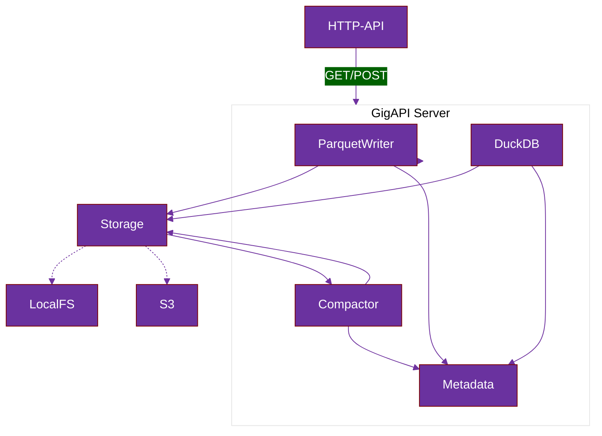

# 

#  GigAPI Storage Engine

Like a durable parquet floor, GigAPI provides rock-solid data foundation — so you can focus on queries not infrastructure. 

GigAPI eliminates classic storage and server limits, unlocking virtually infinite cardinality without compromising query speed and performance. Its DuckDB and Arrow powered engine handles massive parallel ingestion and self-compation of data for heavy aggregations and complex SQL queries, delivering consistent performance as your system scales without storage or cardinality limitations and price tag


> [!WARNING]  
> GigAPI is an open beta developed in public. Bugs and changes should be expected. Use at your own risk.
> 
## Configuration

| Env Var Name           | Description                                 | Default Value       |
|------------------------|---------------------------------------------|---------------------|
| GIGAPI_ROOT            | Root directory for the databases and tables | <current directory> |
| GIGAPI_MERGE_TIMEOUT_S | Merge timeout in seconds                    | 10                  |
| GIGAPI_SAVE_TIMEOUT_S  | Save timeout in seconds                     | 1.0                 |
| GIGAPI_NO_MERGES       | Disables merges when set to true            | false               |
| PORT                   | Port number for the server to listen on     | 8080                |

##  Usage

> Coming Soon

```yml
services:
  gigapi:
    image: ghcr.io/gigapi/gigapi:latest
    container_name: gigapi
    hostname: gigapi
    restart: unless-stopped
    volumes:
      - ./data:/data
    ports:
      - "8080:8080"
    environment:
      - GIGAPI_ENABLED=true
      - GIGAPI_MERGE_TIMEOUT_S=10
      - GIGAPI_ROOT=/data
  gigapi-querier:
    image: ghcr.io/gigapi/gigapi-querier:latest
    container_name: gigapi-querier
    hostname: gigapi-querier
    volumes:
      - ./data:/data
    ports:
      - "8082:8082"
    environment:
      - DATA_DIR=/data
      - PORT=8082
```

##  Write Support
As write requests come in to GigAPI they are parsed and progressively appeanded to parquet files alongside their metadata. The ingestion buffer is flushed to disk at configurable intervals using a hive partitioning schema. Generated parquet files and their respective metadata are progressively compacted and sorted over time based on configuration parameters.

###  API
GigAPI provides an HTTP API for clients to write, currently supporting the InfluxDB Line Protocol format 

```bash
cat <<EOF | curl -X POST http://localhost:8080/quackdb/insert --data-binary @/dev/stdin
weather,location=us-midwest,season=summer temperature=82
weather,location=us-east,season=summer temperature=80
weather,location=us-west,season=summer temperature=99
EOF
```

* _more ingestion protocols coming soon_

###  Data Schema
GigAPI is a schema-on-write database managing databases, tables and schemas on the fly. New columns can be added or removed over time, leaving reconciliation up to readers.

```bash
/data
  /mydb
    /weather
      /date=2025-04-10
        /hour=14
          *.parquet
          metadata.json
        /hour=15
          *.parquet
          metadata.json
```

###  Parquet Compactor
GigAPI files are progressively compacted based on the following logic _(subject to future changes)_


| Merge Level   | Source | Target | Frequency              | Max Size | File Composition  |
|---------------|--------|--------|------------------------|----------|-------------------|
| Level 1 -> 2  | `.1`   | `.2`   | GIGAPI_MERGE_TIMEOUT_S | 100 MB   | Only `.1` files   |
| Level 2 -> 3  | `.2`   | `.3`   | 10× frequency of 1→2   | 400 MB   | Only `.2` files   |
| Level 3 -> 4  | `.3`   | `.3`   | 10× frequency of 2→3   | 4 GB     | Only `.3` files   |

GigAPI Parquet files use the following naming schema:
```
{UUID}.{LEVEL}.parquet
```

##  Read Support
As read requests come in to GigAPI they are parsed and transpiled using the GigAPI Metadata catalog to resolve data location based on database, table and timerange in requests. Series can be used with or without time ranges, ie for calculating averages, etc.

```bash
$ curl -X POST "http://localhost:9999/query?db=mydb" \
  -H "Content-Type: application/json"  \
  -d '{"query": "SELECT count(*), avg(temperature) FROM weather"}'
```
```json
{"results":[{"avg(temperature)":87.025,"count_star()":"40"}]}
```

> GigAPI readers can be implemented in any language and with any OLAP engine supporting Parquet files.

<br>

##   GigAPI Diagram


### Contributors

&nbsp;&nbsp;&nbsp;&nbsp;[](https://github.com/gigapi/gigapi/graphs/contributors)

### Community

[](https://github.com/gigapi/gigapi/stargazers)


###### :black_joker: Disclaimers 

[^1]: DuckDB ® is a trademark of DuckDB Foundation. All rights reserved by their respective owners. [^1]
[^2]: ClickHouse ® is a trademark of ClickHouse Inc. No direct affiliation or endorsement. [^2]
[^3]: InfluxDB ® is a trademark of InfluxData. No direct affiliation or endorsement. [^3]
[^4]: Released under the MIT license. See LICENSE for details. All rights reserved by their respective owners. [^4]
